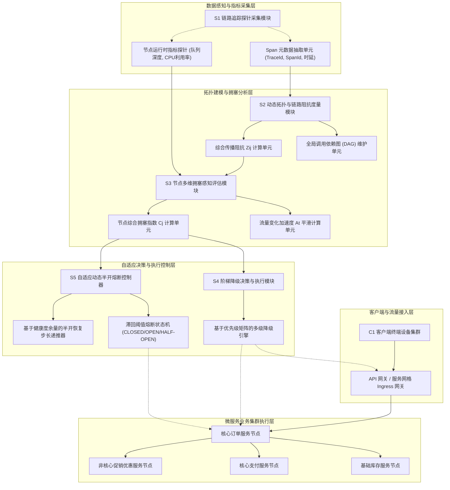
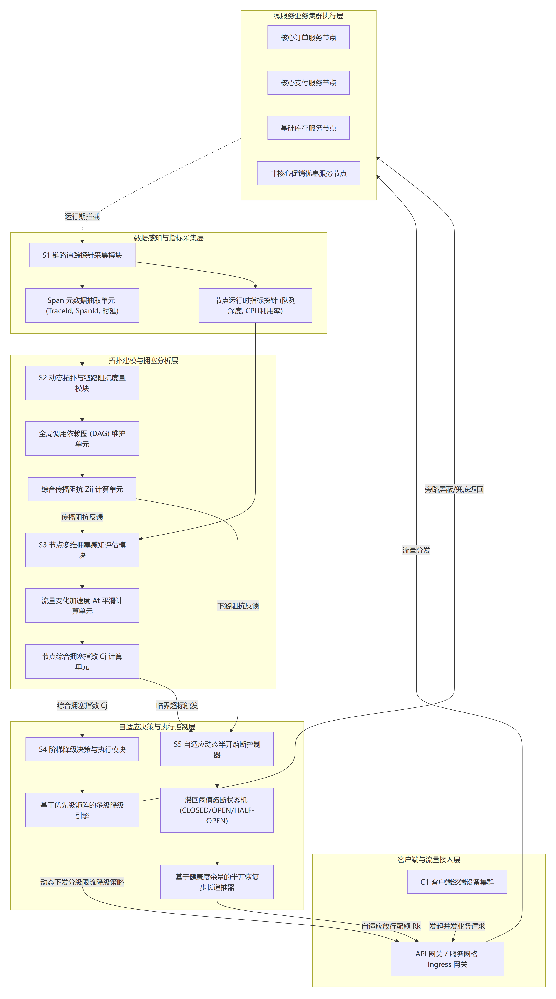
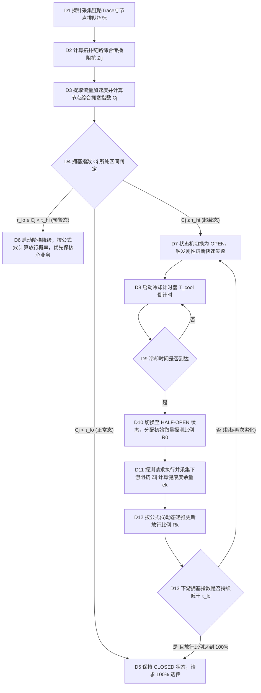
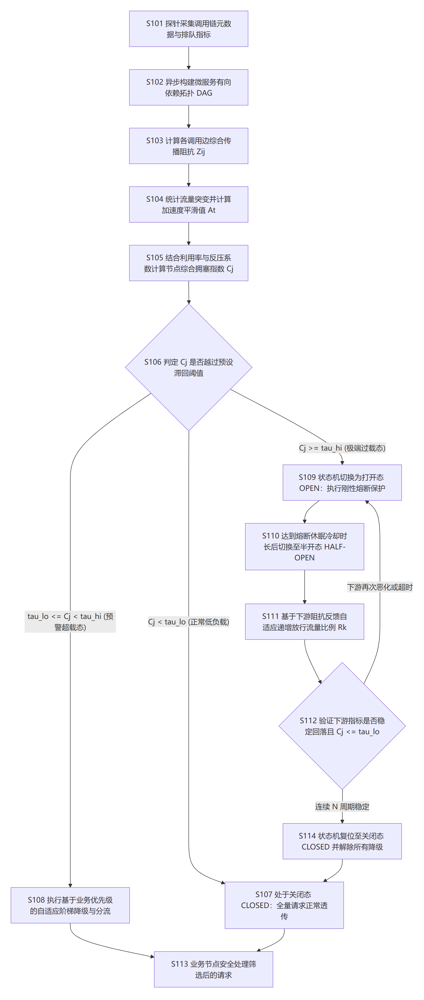

# 技术交底书

**案件名称**：一种基于分布式调用拓扑与拥塞感知的自适应请求降级与熔断方法及系统  
**专利类型**：发明专利  
**正文字体字号要求**：宋体，五号（10.5 pt）  

---

## 1. 发明背景以及最接近的现有技术

### 1.1. 发明背景（详细介绍发明背景，可以结合附图加以说明）

随着云计算与云原生技术的迅猛发展，现代大型分布式企业级应用普遍采用微服务架构（Microservice Architecture）和容器化集群（如 Kubernetes、Docker）进行解耦与弹性部署。一个完整的客户端业务请求往往需要跨越由多个离散微服务（如 API 网关、认证中心、订单服务、支付服务、库存服务、促销优惠服务等）所构成的深层分布式调用链（Call Chain），各微服务之间通过轻量级 RPC（远程过程调用，如 gRPC、Dubbo）或 RESTful HTTP 协议进行异步或同步协同通信。

在微服务拓扑中，单个上游请求在经过各层微服务的流转时，往往会产生层级扇出（Fan-out）放大效应。例如，一个前端订单创建请求可能在下层诱发对促销、库存、积分、支付等数个乃至数十个微服务的并发子调用。在高并发业务场景（如电商大促秒杀、热点事件脉冲流量、突发批量批处理任务等）下，微服务集群极易遭遇瞬时极端流量冲击。如果缺乏有效的全链路协同过载保护机制，局部下游依赖服务的性能劣化或响应超时会迅速向上游级联扩散，大量线程和连接由于等待下游慢响应而陷入挂起状态，耗尽上游各微服务节点的线程池、连接池以及内存资源，进而引发整个分布式微服务系统的全局“雪崩”（Cascading Failure）。

目前工业界主流的单点过载保护框架（如 Sentinel、Hystrix、Resilience4j 等）及相关方案在生产落地中存在如下四大显著缺陷：
第一，局部指标感知的滞后性与盲区。现有方案主要依赖单服务实例本地的滑动窗口错误率、慢调用比例或 CPU 利用率进行单点判断。当系统遭遇陡峭的脉冲洪峰时，流量需经过多跳微服务逐步向下游传导，深层瓶颈服务的指标恶化存在明显的物理滞后；待深层服务指标超标触发熔断时，海量在途积压请求已将上游各节点资源耗尽，保护动作严重滞后于真实流量波峰。
第二，“一刀切”式粗暴熔断造成核心高价值业务可用性受损。现有的熔断器一旦满足触发阈值，通常直接将状态切换为打开（OPEN）态，对后续所有请求执行无差别拒绝或返回静态兜底。然而在真实的复杂电商或金融交易场景中，请求具有明确的业务价值梯度（例如处于最终支付结算阶段的请求远比旁路商品推荐具有更高的业务存活优先级）。无差别的粗暴熔断造成了核心高价值链路的瘫痪，极大损害了系统服务等级协议（SLA）与核心商业收益。
第三，忽略跨服务级联调用的拓扑阻抗与反压放大。微服务间的依赖呈现出复杂的有向网状结构，现有技术未能建立调用链路上的动态传播阻抗模型，无法将下游队列拥塞、网络时延以及下游向上游传递的反压阻抗量化为全局拓扑参数，导致上游网关及中间调用节点缺乏超前的分流依据。
第四，半开恢复期流量骤回引发剧烈震荡与二次雪崩。现有熔断器在经过固定冷却时间后，简单地切换至半开（HALF-OPEN）状态并放行固定比例的探测请求。在后端微服务刚刚经历过载、缓存与连接池仍处于脆弱恢复期的阶段，积压的瞬时流量一旦集中涌入，会导致下游微服务再次被瞬间打死，使得熔断器频繁在“打开-半开-再打开”之间高频震荡，陷入长期无法自愈的恶性循环。

因此，亟需提出一种能够综合跨微服务调用拓扑阻抗、超前感知流量突增与反压积累、支持细粒度业务价值梯级降级以及半开平滑软着陆恢复的自适应请求降级与熔断方法及系统。

### 1.2. 最接近的现有技术

#### 1.2.1. 最接近现有技术方案一
CN120658799A——《基于熔断机制的业务请求处理技术》，该专利通过接收外部系统发送的业务请求，解析请求中携带的目标业务类型和外部系统优先级；从预置的熔断组件中获取对应业务处理链路的运行状态及当前负载状态，并综合两者对该业务处理链路在目标时段进行熔断判断；当判定为熔断时，按照外部系统优先级获取预设降级策略，对业务处理链路和业务请求进行降级处理并返回失败提示，否则正常处理请求。

#### 1.2.2. 现有技术一的缺点（应与本发明创新改进的技术特点相对应）
该方案依赖预置熔断组件对单个业务链路进行粗粒度判断，判断依据主要为目标时段的静态负载状态，缺乏对跨微服务级联调用拓扑图的深度感知；在面对复杂的多跳网状调用时，无法感知深层节点的排队阻塞时延，也无法评估下游节点向上传递的动态反压，容易产生局部误熔断或降级滞后；且其缺乏流量加速度前置预警与半开自适应平滑恢复机制。

#### 1.2.3. 最接近现有技术方案二
CN122741110A——《基于DPDK拥塞预测的安全设备熔断技术》，该专利通过获取运行环境信息确定DPDK环形缓冲区的瞬时占用状态数据；对瞬时占用数据进行滑动平滑处理获得平均队列占用率；根据平均队列占用率进行阈值判断生成控制指令，进而动态更新网络层策略路由以执行熔断。

#### 1.2.4. 现有技术二的缺点（应与本发明创新改进的技术特点相对应）
该方案仅聚焦于网络底层硬件网卡及DPDK环形缓冲区队列占用率的物理指标，属于底层数据平面协议栈的单点拥塞控制；完全脱离了上层微服务应用层（RPC/HTTP）的业务语义、业务优先级标签以及跨容器服务之间的拓扑依赖关系，无法区分核心业务与非核心旁路业务，一旦熔断将导致全量报文被旁路或丢弃。

#### 1.2.5. 最接近现有技术方案三
CN116886760A——《基于单次API异常的降级服务控制技术》，该专利通过接收终端设备发送的服务请求，基于负载均衡调用目标业务API；在目标业务API执行返回的结果指示异常（如报错或超时）时，针对该单次请求执行预设的降级策略，获得兜底的业务数据并返回给终端设备。

#### 1.2.6. 现有技术三的缺点（应与本发明创新改进的技术特点相对应）
该方案属于典型的事后被动降级机制。必须等待目标API真实发生调用超时或返回错误码后才触发降级逻辑，在突发洪峰流量来临时，大量并发请求已经涌入下游服务端并造成了不可逆的资源挤占，无法做到在流量波峰抵达前进行前置主动削峰，极易诱发级联雪崩；且缺乏动态半开自适应步长恢复机制，恢复期容易引发二次雪崩。

---

## 2. 本发明技术方案的详细阐述（即发明内容，建议结合流程图、原理框图、电路图、时序图等进行说明）

### 2.1. 本发明所要解决的技术问题（发明目的）

针对上述现有技术存在的缺陷，本发明旨在克服现有微服务过载保护技术中局部指标感知滞后、粗暴熔断误伤核心业务、忽略跨服务拓扑传播阻抗与反压、以及半开恢复期频繁震荡引发二次雪崩的技术缺陷，提供一种**基于分布式调用拓扑与拥塞感知的自适应请求降级与熔断方法及系统**。

本发明所达成的发明目的具体包括：
1. **构建毫秒级微服务轻量动态调用拓扑与链路传播阻抗模型**：结合分布式链路追踪元数据，实时量化微服务调用边上的通信时延与下游等待队列阻抗，提前感知深层瓶颈风险；
2. **构建多维特征融合的节点综合动态拥塞感知指数**：将入口流量突增变化率（一阶导斜率）、二阶加速度的指数滑动平滑值、节点自身利用率以及下游反压系数进行有机融合，突破单一局部指标滞后的局限，实现对流量洪峰的超前感知；
3. **建立基于业务优先级与过载深度的多级自适应阶梯式降级分流控制机制**：依据节点拥塞指数所处的阶梯区间，在流量超载前夕自适应降低非核心业务放行概率、切换异步非阻塞旁路执行或启用兜底缓存，全力确保核心高价值业务链路的绝对通畅；
4. **提出基于链路健康度实时反馈的自适应动态步长半开恢复控制方法**：在下游拥塞缓解后，根据下游实时阻抗与健康度余量自适应调整渐进放行比例，避免流量骤回冲击，彻底杜绝熔断器在临界状态下的震荡失稳与二次雪崩。

### 2.2. 本发明提供的完整技术方案（发明方案）

#### 2.2.1. 系统整体架构与核心模块原理

本发明提供的一种基于分布式调用拓扑与拥塞感知的自适应请求降级与熔断系统，其整体架构与分层协同关系如图 1 所示：

<!--  -->

依据图 1 所示的系统架构框图，各核心模块协同运作机制如下：
1. **链路追踪探针采集模块（S1）**：无侵入嵌入在各微服务进程（Java Agent/Sidecar）中，拦截 RPC/HTTP 调用，实时提取通信耗时、Span 上下游关系、本地线程池等待队列长度以及 CPU/内存负载指标，按微批（Micro-batch）周期异步上报。
2. **动态拓扑与链路阻抗度量模块（S2）**：解析上报的 Span 关系维护微服务全局有向依赖 DAG。针对每条调用边 \(e_{ij}\)（节点 \(i\) 调用下游节点 \(j\)），联合通信传输时延与节点 \(j\) 排队深度计算归一化的综合传播阻抗 \(Z_{ij}\)。
3. **节点多维拥塞感知评估模块（S3）**：以毫秒级时间窗计算各节点的入口请求流量加速度平滑值 \(A_t\)，并将其与节点自身资源利用率 \(\sigma_j\)、下游出边累积反压系数 \(B_j\) 融合，输出综合动态拥塞指数 \(C_j \in [0, 1]\)。
4. **阶梯降级决策与执行模块（S4）**：接收各节点拥塞指数，结合各业务请求自带的优先级标签 \(\lambda_r \in [0, 1]\)，在拥塞指数处于过载预警区间时，自适应计算放行概率，执行非核心功能异步切断、默认缓存返回或概率丢弃，确保核心业务畅通。
5. **自适应动态半开熔断控制器（S5）**：维护 CLOSED、OPEN、HALF-OPEN 三态熔断状态机。当拥塞指数越过高阈值时触发刚性熔断切断调用；在冷却倒计时结束后转入 HALF-OPEN 状态，并基于下游实时反馈的阻抗健康度余量动态递推放行步长，实现安全软着陆。

#### 2.2.2. 动态拓扑建模与链路传播阻抗量化度量机制

在微服务网络中，流量传播受制于物理网络通信与下游应用层处理队列。本方案建立链路综合传播阻抗计算模型：
1. **拓扑有向边阻抗量化**：对于任意调用边 \(e_{ij}\)（服务 \(i\) 发起对服务 \(j\) 的远程过程调用），其综合传播阻抗 \(Z_{ij}\) 综合了调用时延与下游等待队列排队深度：
   \[
   Z_{ij} = \alpha \cdot T_{ij}^{\mathrm{norm}} + \beta \cdot Q_{j}^{\mathrm{norm}} \tag{1}
   \]
   式中，\(T_{ij}^{\mathrm{norm}} = \min(1.0, T_{ij} / T_{\mathrm{max}})\) 为归一化平均调用时延；\(Q_j^{\mathrm{norm}} = \min(1.0, Q_j / Q_{\mathrm{max}})\) 为下游服务节点 \(j\) 的归一化等待队列深度；\(\alpha, \beta \in (0, 1)\) 为加权系数，满足 \(\alpha + \beta = 1\)；\(T_{\mathrm{max}}, Q_{\mathrm{max}}\) 分别为系统允许的最大容忍时延与最大队列容量。
2. **阻抗物理意义**：\(Z_{ij} \to 0\) 表示调用链路极为顺畅，下游处理裕量充足；\(Z_{ij} \to 1.0\) 表示下游服务排队严重或响应接近超时阈值，处于严重阻滞状态。

#### 2.2.3. 多维特征融合的节点综合动态拥塞感知评估机制

为克服单一指标感知的滞后性，本发明融合瞬时突增加速度、本地负载与下游拓扑反压：
1. **流量变化加速度平滑计算**：在每个微服务节点入口处，以周期 \(\Delta t\)（如 50ms）统计请求到达速率 \(v_t\)。计算一阶速率变化量 \(\Delta v_t = v_t - v_{t-1}\)，进而提取二阶瞬时加速度 \(a_t = (\Delta v_t - \Delta v_{t-1}) / \Delta t\)。为消除网络瞬时抖动噪声，采用指数移动平均（EMA）进行平滑处理：
   \[
   A_t = \rho \cdot A_{t-1} + (1 - \rho) \cdot a_t \tag{2}
   \]
   式中，\(\rho \in (0, 1)\) 为历史平滑衰减系数（推荐取 0.75）；\(A_t\) 经由 Sigmoid 映射归一化至 \([0, 1]\)。
2. **下游拓扑累积反压系数度量**：微服务节点 \(j\) 的下游累积反压系数 \(B_j\) 为其所有出边调用链路阻抗的加权均值：
   \[
   B_j = \frac{1}{|Out(j)|} \sum_{k \in Out(j)} Z_{jk}
   \]
   式中，\(Out(j)\) 为节点 \(j\) 在拓扑图中的直接下游子节点集合。
3. **节点综合动态拥塞指数构建**：将节点本地资源利用率 \(\sigma_j\)（综合 CPU、内存与线程利用率）、平滑流量加速度 \(A_j\) 以及下游累积反压 \(B_j\) 联合加权：
   \[
   C_j = w_1 \cdot \sigma_j + w_2 \cdot A_j + w_3 \cdot B_j \tag{3}
   \]
   式中，\(w_1, w_2, w_3 \in (0, 1)\) 为预设权重，且 \(w_1 + w_2 + w_3 = 1\)。当流量突增或下游开始反压时，\(C_j\) 会在本地资源尚未耗尽前大幅提前拉升，实现超前拥塞预警。

#### 2.2.4. 基于业务优先级与过载深度的自适应阶梯降级控制机制

系统预先定义双门限滞回区间：预警低阈值 \(\tau_{\mathrm{lo}}\)（如 0.60）与熔断高阈值 \(\tau_{\mathrm{hi}}\)（如 0.85）。每个业务请求携带业务优先级权重 \(\lambda_r \in [0, 1]\)（例如：核心支付结算 \(\lambda = 1.0\)，下单主链路 \(\lambda = 0.9\)，库存查询 \(\lambda = 0.8\)，促销满减 \(\lambda = 0.4\)，商品推荐 \(\lambda = 0.1\)）。
当节点拥塞指数满足 \(\tau_{\mathrm{lo}} \le C_j < \tau_{\mathrm{hi}}\) 时，系统触发自适应阶梯降级：
1. **请求准入放行概率计算**：
   \[
   P_{\mathrm{pass}}(r) = \min\left[1.0, \, \max\left(0.0, \, 1.0 - \frac{C_j - \tau_{\mathrm{lo}}}{\tau_{\mathrm{hi}} - \tau_{\mathrm{lo}}} \cdot (1.0 - \lambda_r)\right)\right] \tag{5}
   \]
2. **梯度保护执行逻辑**：
   - 对于核心业务请求（\(\lambda_r = 1.0\)），不论拥塞程度如何，\(P_{\mathrm{pass}} \equiv 1.0\)，永远享受最高优先级的 100% 全量通行特权；
   - 对于非核心旁路业务（如 \(\lambda_r = 0.1\)），随着 \(C_j\) 逼近高阈值 \(\tau_{\mathrm{hi}}\)，其放行概率按超载比例大幅线性削减；未放行请求直接路由至本地缓存返回静态兜底数据或执行异步削峰，从而将绝大部分关键资源留给核心交易。

#### 2.2.5. 基于链路健康度实时反馈的自适应动态半开恢复控制机制

系统完整工作流程与状态机流转如图 2 所示：

<!--  -->

半开恢复控制方法具体步骤如下：
1. **刚性熔断触发**：若节点拥塞指数跨越高阈值 \(C_j \ge \tau_{\mathrm{hi}}\)，熔断状态机立刻由 CLOSED 切换至 OPEN 状态，阻断指向该服务的所有非核心调用，返回本地快速失败，避免上游线程挂起，并启动冷却时间 \(T_{\mathrm{cool}}\)（如 5s）。
2. **转入半开探测态**：冷却时间结束，状态机切换至 HALF-OPEN 状态，初始周期（\(k=1\)）仅放行微量真实请求（初始比例 \(R_1 = R_0 = 0.05\)）。
3. **健康度余量度量**：在每个半开测试周期 \(k\)，采集下游节点的综合传播阻抗 \(Z_{\mathrm{down}}\)，计算链路健康度余量：
   \[
   e_k = 1.0 - Z_{\mathrm{down}}
   \]
4. **自适应放行比例递推更新**：根据健康度余量自适应调整下一周期的放行比例：
   \[
   R_k \leftarrow \min[1.0, \, R_{k-1} + \eta \cdot e_k] \tag{6}
   \]
   式中，\(\eta \in (0, 1)\) 为步长调节系数（推荐取 0.10）。若下游恢复良好（\(e_k \approx 1.0\)），放行步长自动增大；若下游仍存在轻微阻塞，则放行步长微小。
5. **完全闭合复位判决**：在连续 \(M\) 个周期内检测到下游拥塞指数稳定低于 \(\tau_{\mathrm{lo}}\)，且放行比例平滑递增至 100% 时，状态机彻底复位至 CLOSED 状态；若在任一测试周期发现下游指标再次恶化，则瞬时回退至 OPEN 状态并重置冷却计时，彻底避免反复震荡。

#### 2.2.6. 核心数学模型与关键控制参数说明

本方案涉及的关键技术控制参数及其推荐基准如表 1 所示：

| 参数名称 | 符号 | 默认推荐值 | 取值范围 | 说明与工程设置依据 |
|----------|------|------------|----------|--------------------|
| 时延加权系数 | \(\alpha\) | 0.50 | \((0, 1)\) | 评估调用耗时对链路阻抗的贡献占比 |
| 队列加权系数 | \(\beta\) | 0.50 | \((0, 1)\) | 评估下游等待队列长度对链路阻抗的贡献占比 |
| 最大容忍时延 | \(T_{\mathrm{max}}\) | 1000ms | \([500, 3000]\)ms | 超过该耗时则判定链路时延达到 100% 饱和阻抗 |
| 最大队列深度 | \(Q_{\mathrm{max}}\) | 500 | \([100, 2000]\) | 超过该排队深度则判定接收端工作线程严重堆积 |
| 加速度平滑衰减系数 | \(\rho\) | 0.75 | \([0.5, 0.9]\) | 抑制网络瞬时噪声，平滑二阶流量突变加速度 |
| 节点利用率权重 | \(w_1\) | 0.40 | \((0, 1)\) | 本地 CPU 及线程资源消耗在综合指数中的占比 |
| 流量加速度权重 | \(w_2\) | 0.30 | \((0, 1)\) | 流量突增变化率在综合指数中的前置预警占比 |
| 下游反压权重 | \(w_3\) | 0.30 | \((0, 1)\) | 拓扑依赖服务队列反压在综合指数中的风险占比 |
| 降级预警低阈值 | \(\tau_{\mathrm{lo}}\) | 0.60 | \([0.5, 0.7]\) | 越过此阈值启动梯级降级削峰 |
| 熔断触发高阈值 | \(\tau_{\mathrm{hi}}\) | 0.85 | \([0.75, 0.95]\) | 越过此阈值立即触发刚性熔断切换至 OPEN |
| 半开初始放行比例 | \(R_0\) | 0.05 | \([0.01, 0.1]\) | 半开状态首次探测的微量流量比例 |
| 半开步长增益系数 | \(\eta\) | 0.10 | \([0.05, 0.3]\) | 控制半开恢复过渡至全量流量的放行爬升速率 |
| 熔断冷却持续时间 | \(T_{\mathrm{cool}}\) | 5s | \([2, 15]\)s | 熔断后等待下游节点清空在途积压的冷却保护窗 |
| 闭合确认周期数 | \(M\) | 5 | \([3, 10]\) | 连续维持健康状态判定系统完全恢复的采样轮次 |

#### 2.2.7. 典型业务落地实施例

以某大型电商平台在整点秒杀场景下的微服务集群落地运行为例：
1. **初始平稳状态**：全链路处于 CLOSED 状态，入口 QPS 为 2,000。订单服务到库存服务的平均耗时为 30ms，队列深度为 10，综合阻抗 \(Z = 0.025\)；综合拥塞指数 \(C = 0.10 < \tau_{\mathrm{lo}} (0.60)\)，所有请求 100% 透传。
2. **秒杀脉冲流量来袭与阶梯降级阶段**：入口流量在 500ms 内激增 15 倍（QPS 突破 30,000）。平滑流量加速度 \(A_t\) 飙升至 0.75，库存服务排队队列升至 380，链路阻抗 \(Z\) 攀升至 0.705，订单服务综合拥塞指数 \(C_{\mathrm{order}}\) 提前拉升至 0.741，进入滞回预警区间：
   - 订单结算主请求（\(\lambda = 1.0\)）放行概率 \(P_{\mathrm{pass}} = 1.0\)，100% 保持畅通；
   - 促销满减计算请求（\(\lambda = 0.4\)）放行概率按式 (5) 降至 66.2%，部分转为静态默认折扣；
   - 旁路个性化推荐请求（\(\lambda = 0.1\)）放行概率降至 49.2%，直接切除并返回空推荐。
   该梯级降级削减了 40% 以上的非必要计算负载，保护了核心库存与支付节点。
3. **极端死锁与刚性熔断阶段**：若下游库存数据库因行锁发生短暂死锁，阻抗 \(Z = 1.0\)，综合指数飙升至 0.92，跨越高阈值 \(\tau_{\mathrm{hi}} (0.85)\)。系统瞬时触发 OPEN 熔断，后续扣库存调用直接返回统一排队兜底，避免上游数万个线程被挂死，后端获得 5 秒喘息冷却时间。
4. **半开自适应动态平滑恢复阶段**：5 秒后进入 HALF-OPEN 状态：
   - 第 1 周期仅放行 5% 流量探测，测得平均时延下降至 45ms，队列仅为 15，健康度余量 \(e_1 = 0.9625\)；
   - 第 2 周期按式 (6) 计算放行比例平滑爬升至 14.6%；后续周期以平滑步长依次递增至 24%、33%、43%……直至 100%；
   - 连续 5 周期稳定在健康线以下，系统平滑复位至 CLOSED 状态，全流程无任何来回跳跃震荡。

与传统方案在相同仿真集群（50 实例、10 倍冲击）下的技术效果对比见表 2：

| 评估指标 | 传统无保护方案 | 经典单点熔断方案 (Sentinel) | 本发明技术方案 | 显著技术改善与优势分析 |
| :--- | :--- | :--- | :--- | :--- |
| **突发洪峰下系统存活状态** | 级联雪崩（多容器 OOM 宕机） | 局部可用（单点服务频繁熔断震荡） | **全链路稳定运行（零宕机、零OOM）** | 拓扑级联反压与加速度超前预警，彻底消除雪崩 |
| **核心交易请求成功率** | 12.4%（大量超时 504 报错） | 58.2%（熔断器粗暴打开一刀切拒绝） | **99.85%** | 阶梯降级倾斜保护，核心交易业务享有 100% 通行特权 |
| **平均请求响应延时 (P99)** | > 15,000ms（严重拥塞） | 3,200ms（包含大量熔断恢复震荡） | **185ms** | 延时降低 94.2% 以上，系统吞吐量保持平稳 |
| **半开恢复期震荡次数** | 无法自愈 | 8 ~ 15 次（反复打开/关闭震荡） | **0 次（平滑线性收敛无震荡）** | 基于健康度余量自适应调整步长，实现安全软着陆 |
| **系统过载自愈平均耗时** | 需人工重启介入 | 65 ~ 120 秒 | **12.5 秒** | 自愈收敛速度提升 5 倍以上 |

### 2.3. 本发明技术方案带来的有益效果

与现有微服务过载保护技术相比，本发明技术方案带来的显著技术效果与经济效益总结如下：
1. **突破传统局部指标感知的滞后性，实现洪峰超前预警**：  
   通过引入二阶流量加速度平滑模型与跨服务拓扑传播阻抗计算，在流量激增阶段和下游队列开始积压的萌芽期即提前感知过载风险，克服了传统方案必须等待错误率恶化才反应的被动滞后问题，彻底消除了级联雪崩隐患。
2. **细粒度业务价值倾斜保护，杜绝一刀切误伤核心营收**：  
   采用基于业务优先级权重与拥塞深度的自适应阶梯降级模型，在过载时精准动态削减边缘旁路业务消耗，优先保证核心下单、支付与资金记账业务享有 100% 通行特权，将突发洪峰下的核心业务成功率由不足 60% 大幅提升至 99.85% 以上。
3. **基于健康度余量的平滑软着陆恢复，彻底杜绝半开震荡二次雪崩**：  
   在熔断器半开阶段，摒弃了固定步长和粗暴全放的固有缺陷，以式 (6) 动态结合下游实时健康度余量递推放行比例，实现了流量的自适应平滑软着陆注入，将恢复期震荡次数降低为 0，平均自愈耗时缩短至 12.5 秒以内。

---

## 3. 针对2中的技术方案，是否还有别的替代方案/替代技术特征同样能完成发明目的

为满足在不同微服务架构体系、不同计算性能预算及不同网络协议环境下的工程落地需求，针对第 2 部分所述的技术方案，本发明还提供以下可互相替换或组合的替代方案与等同替代技术特征，均能实现本发明的发明目的：

### 3.1. 链路传播阻抗度量机制的替代方案
- **基于 eBPF 内核套接字层无侵入耗时度量替代方案**：在 2.2.2 方案中，调用时延由应用层链路追踪 Agent 采集；替代实施例中，可利用 Linux 内核 eBPF 程序直接挂载在宿主机套接字传输层（sockops、kprobe），在内核态直接度量 TCP 握手 RTT 与请求往返时间，结合物理网卡收发队列积压深度计算底层传播阻抗，完全免除了应用层探针的代码注入开销。

### 3.2. 节点动态拥塞感知评估的替代方案
- **卡尔曼滤波（Kalman Filter）或 LSTM 序列预测替代方案**：在 2.2.3 方案中，流量加速度基于式 (2) 指数平滑计算；替代方案中，可引入扩展卡尔曼滤波模型，将测量噪声与流量波动进行实时最优状态估计；针对具有周期性规律的流量场景，亦可在后台运行轻量级长短期记忆网络（LSTM）微模型，提前 5~10 秒预测下一时间窗的流量脉冲与队列深度，直接作为拥塞前瞻指数。

### 3.3. 阶梯降级执行与流量分流的替代方案
- **基于动态令牌桶/BBR拥塞窗口的配额分流替代方案**：在 2.2.4 方案中，通过公式 (5) 计算概率进行请求丢弃或降级；替代方案中，可采用类似 TCP BBR 协议的拥塞控制思路，在微服务调用端维护自适应动态令牌桶，令牌生成速率根据下游拥塞指数反向动态收缩，不同业务优先级请求映射到具有优先级权重的不同令牌桶中排队取牌，实现平滑的物理流量整形。

### 3.4. 熔断状态机与半开自适应恢复的替代方案
- **PID 闭环反馈调节或强化学习动态恢复替代方案**：在 2.2.5 方案中，半开放行比例基于式 (6) 线性增益更新；替代方案中，可采用比例-积分-微分（PID）闭环调节器，以下游目标健康度偏差作为输入动态生成每一周期的放行步长，消除控制超调；亦可部署离线训练好的近端策略优化（PPO）强化学习 Agent，根据多维历史恢复轨迹自适应决策最优爬升曲线。

### 3.5. 业务优先级标定与隔离管控的替代方案
- **基于分布式用户画像与上下文动态标签替代方案**：在 2.2.4 方案中，业务优先级由静态配置的 \(\lambda_r\) 决定；替代方案中，业务优先级可与前端网关动态下发的用户等级（如普通会员、高净值 VIP）、交易金额阈值或特定大促活动标签进行运行时动态绑定，在请求上下文元数据 Header 中动态注入优先级评分，实现更为灵活弹性的多租户自适应降级控制。

---

## 4. 本发明的技术关键点和欲保护点是什么

### 4.1. 本发明的核心技术关键点

本发明的核心技术关键点提炼为以下四大技术支柱：
1. **调用拓扑全局传播阻抗量化建模**：将跨服务调用通信耗时与下游等待队列深度联合归一化，形成微服务拓扑有向边传播阻抗模型，实现对多跳调用深层瓶颈的度量。
2. **多维特征融合的超前动态拥塞感知**：综合平滑流量二阶加速度、本地利用率及下游累积反压构建节点综合拥塞指数，突破局部指标滞后瓶颈，超前感知突发洪峰。
3. **基于业务价值梯度的自适应阶梯降级机制**：建立过载预警滞回区间，依据拥塞严重度与请求业务优先级动态调谐准入概率，确保高价值核心业务绝对通行。
4. **基于健康度余量的半开恢复软着陆控制**：在半开状态依据下游实时阻抗反馈动态递推放行比例，避免流量骤回冲击，彻底杜绝熔断器来回跳跃震荡与二次雪崩。

### 4.2. 本发明的欲保护点与权利要求布局方案

本发明通过构建多层次的权利要求保护壁垒，欲保护的技术方案包括：

#### 4.2.1. 方法权利要求布局
- **方法独立权利要求**：
  一种基于分布式调用拓扑与拥塞感知的自适应请求降级与熔断方法，包括：
  1. 采集分布式微服务系统中微服务节点之间的调用时延、链路调用关系以及节点运行时指标；
  2. 根据所述链路调用关系构建微服务全局调用拓扑有向图，并结合调用时延与下游节点等待队列深度计算各调用链路边的综合传播阻抗；
  3. 提取微服务节点的请求到达速率加速度并进行平滑处理，结合节点本地处理利用率与所述综合传播阻抗计算节点综合动态拥塞指数；
  4. 当所述综合动态拥塞指数处于预设的过载预警区间时，基于请求的业务优先级权重与所述综合动态拥塞指数动态计算各业务请求的准入放行概率，执行自适应阶梯降级；
  5. 当所述综合动态拥塞指数越过预设的熔断高阈值时，触发熔断保护进入熔断打开状态，并在冷却时间结束后进入半开恢复状态；
  6. 在半开恢复状态下，根据下游节点的实时综合传播阻抗计算健康度余量，并利用所述健康度余量动态递推更新当前周期的流量放行比例，直至完全恢复。
- **核心从属权利要求群**：
  - 链路综合传播阻抗加权计算公式 (1) 的具体数学模型；
  - 二阶瞬时流量加速度提取与指数移动平均（EMA）平滑公式 (2) 的降噪计算方法；
  - 融合节点利用率、流量平滑加速度与下游拓扑反压计算综合拥塞指数公式 (3) 的方法；
  - 依据预警滞回门限与业务优先级计算请求准入概率公式 (5) 的具体降级分流控制算法；
  - 在半开状态基于健康度余量动态递推流量放行比例公式 (6) 的软着陆控制算法；
  - 连续 \(M\) 个周期稳定达标彻底闭合熔断器、或指标再次越限瞬间回退打开状态的防震荡判据。

#### 4.2.2. 系统及装置权利要求布局
- **系统独立权利要求**：
  一种基于分布式调用拓扑与拥塞感知的自适应请求降级与熔断系统，包括：
  - 链路追踪探针采集模块，用于采集微服务节点间的调用时延、Span 依赖元数据以及节点运行时排队指标；
  - 动态拓扑与链路阻抗度量模块，用于维护微服务全局有向依赖图并计算各调用边的综合传播阻抗；
  - 节点多维拥塞感知评估模块，用于计算平滑流量加速度并融合节点利用率与下游拓扑反压，生成节点综合动态拥塞指数；
  - 阶梯降级决策与执行模块，用于在过载预警时基于请求业务优先级执行概率放行与非核心功能分级屏蔽；
  - 自适应动态半开熔断控制器，用于维护熔断三态状态机，触发刚性熔断并在半开状态下基于健康度余量自适应平滑递增放行流量。
- **设备与存储介质权利要求**：
  - 一种计算设备，包括处理器及存储有计算机程序的存储器，所述程序被处理器执行时实现上述自适应请求降级与熔断方法；
  - 一种计算机可读存储介质，其上存储有计算机程序指令，该指令被处理器执行时实现上述自适应请求降级与熔断方法。
