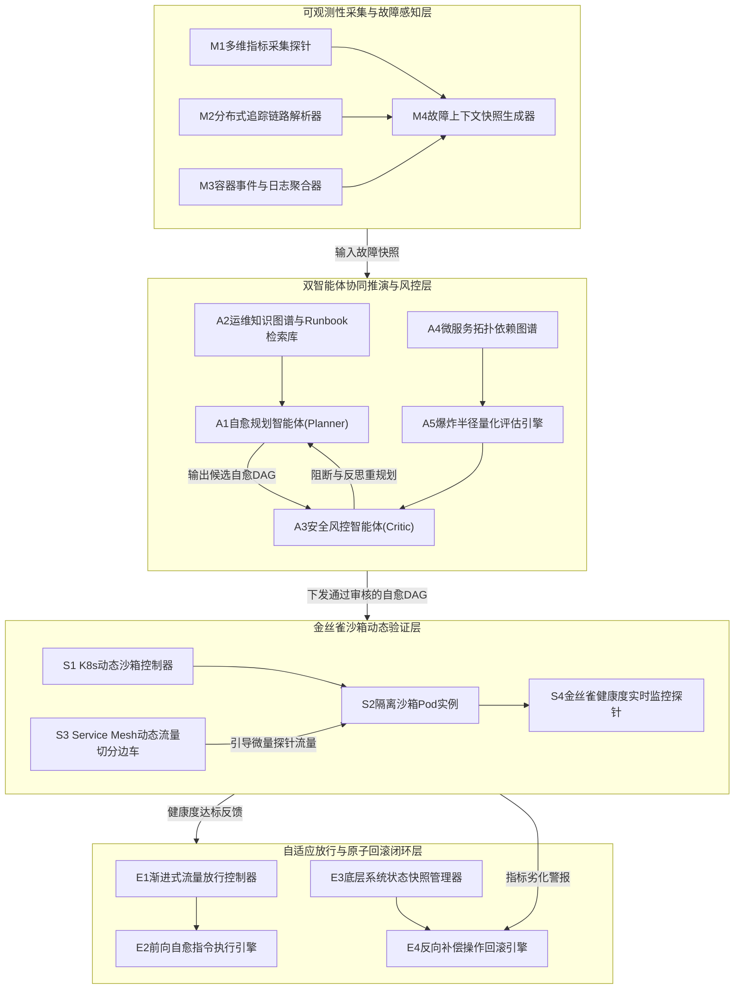
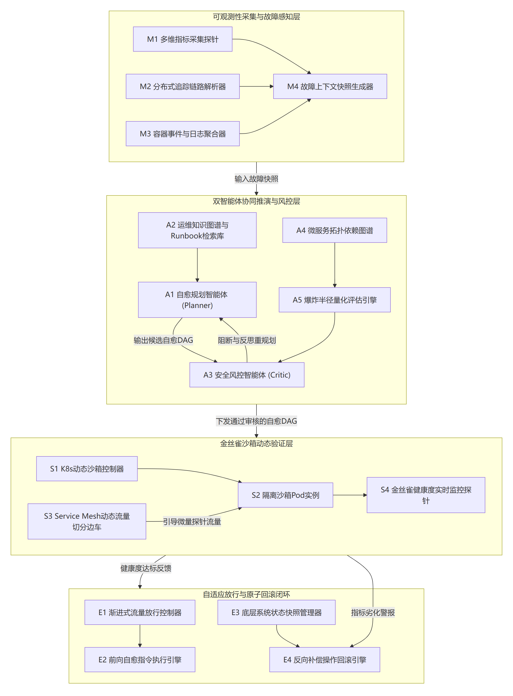
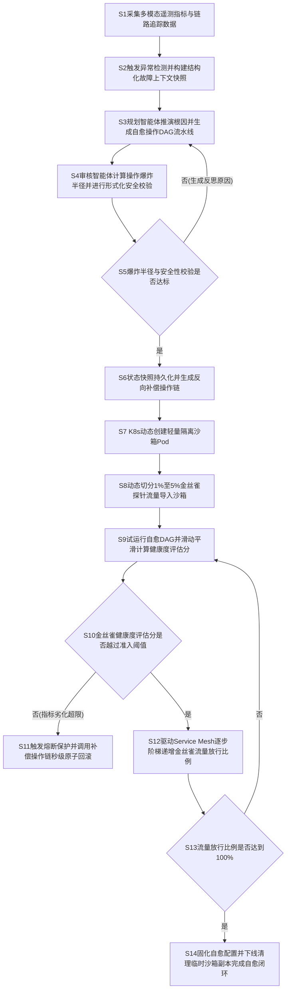
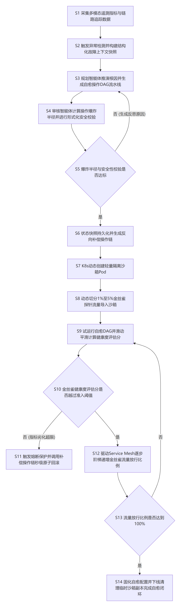

# 技术交底书

**案件名称**：一种基于双智能体协同与金丝雀沙箱验证的云原生微服务故障自愈方法及系统
**专利类型**：发明专利
**正文字体字号要求**：宋体，小四（12 pt）

---

## 1. 发明背景以及最接近的现有技术

### 1.1. 发明背景（详细介绍发明背景，可以结合附图加以说明）

随着云计算技术与云原生（Cloud Native）理念的持续演进，以容器编排系统（Kubernetes）与服务网格（Service Mesh，如Istio、Envoy）为核心的基础设施底座在金融、电商、电信等各行业超大规模分布式系统中获得了深度普及。在现代微服务架构体系下，单套生产系统往往由数十至数千个细粒度、解耦的微服务实例协同组成，各微服务之间依托服务注册发现机制、高效远程过程调用（RPC，如gRPC、Dubbo）、RESTful HTTP协议以及异步消息队列（如Kafka、RocketMQ）构建起深层、网状的拓扑调用关系。

虽然微服务架构极大地提升了软件系统的敏捷交付效率与局部水平扩展能力，但其系统内部错综复杂的依赖链路与网络环境的动态不确定性，也使得系统运行时的稳定性保障面临前所未有的严峻挑战。在高度异构且动态伸缩的云原生网格中，生产环境瞬时面临各类突发且多样的软硬件故障，例如：工作节点或Pod级别的内存泄漏（Memory Leak）、JVM垃圾回收（Full GC）停顿过长、数据库慢查询引发的连接池占满、高并发争抢导致的线程池耗尽、第三方外部依赖服务不可用引发的级联超时、以及配置热加载漂移等。由于微服务拓扑中下游节点向上传递的动态反压效应，单一点状微服务的局部劣化极易在短时间内呈指数级向上游调用链级联扩散，迅速耗尽核心服务的计算、网络与连接资源，最终引发全局微服务集群的“雪崩效应”（Cascading Failure），对企业的服务等级目标（SLO）与核心业务可用性造成致命打击。

为保障业务高可用，智能运维（AIOps）体系正经历由“被动监控告警与人工紧急介入”向“自动化故障诊断与自主自愈控制”的深层次演进。近年来，具备强大自然语言与代码长上下文理解、因果逻辑推演能力的大语言模型（LLM）与自主智能体（Autonomous Agent）技术开始被探索应用于微服务故障诊断与自动化修复领域。运维团队期望通过智能体自主解析多模态可观测性遥测数据（时序指标Metrics、链路调用Trace、容器日志Logs），推理故障根因并自主规划下发修复指令（如参数热调、网络隔离、容器重启、流量切分等）。

然而，将大模型智能体直接引入生产集群的高危控制回路存在难以逾越的工程鸿沟，主要体现在以下核心痛点：
首先，大语言模型天然存在概率生成特性的“模型幻觉”（Hallucination）与非确定性输出缺陷。在缺乏底层微服务物理依赖拓扑严格硬约束的环境下，大模型容易生成脱离实际生产拓扑的高危甚至灾难性指令（例如错误删除包含持久化业务数据的PersistentVolumeClaim存储卷、在高并发峰值期间盲目全量重启核心主从数据库Pod等），这种未经严格审查的指令下发将诱发比原发故障更加严重的次生灾害。
其次，线上突发故障的应急排障具有极强的时间窗口敏感性，存在至关重要的“黄金止损期”（通常为1至5分钟）。传统离线软件测试与预发布验证所依赖的全量克隆沙箱方案，需要完整拉起整套微服务依赖链路及底层数据库集群，资源占用沉重且容器冷启动耗时长达数分钟至数十分钟，根本无法满足线上生产事故发生时的秒级快速试错验证需求。
再次，现有的故障恢复或发布机制多依赖人工预先配置的静态流量比例（如硬编码放行10%流量），缺乏在自愈动作执行过程中结合端到端时延、错误率及关联告警进行多维指标平滑评估与放行步长动态自适应调谐的控制闭环，易导致自愈尚未完全生效的实例过早承接全量线上流量而诱发二次雪崩。
最后，现有自愈脚本工具普遍缺乏事前底层运行状态的快照持久化，以及与自愈动作严格对偶的逆向事务补偿链机制，一旦自愈动作未能奏效甚至引发指标恶化，无法在秒级时间内将系统无损复原至故障发生前的安全基准线。

因此，亟需研发一种能够兼顾大模型因果推理智能化与底层物理拓扑硬约束安全边界，且具备秒级轻量验证与原子反向回滚兜底能力的云原生微服务故障自愈新方法与系统。

### 1.2. 最接近的现有技术

#### 1.2.1. 最接近现有技术方案一
CN115795059A——《一种面向敏捷开发的威胁建模方法及系统》，该专利通过在敏捷开发流程中构建威胁建模与自动化安全审核机制，识别系统代码与配置中的潜在风险漏洞并执行阻断或审批。

#### 1.2.2. 现有技术一的缺点（应与本发明创新改进的技术特点相对应）
该方案聚焦于开发与构建阶段的静态威胁建模与代码安全审查，无法应用于生产集群运行时的实时动态自愈；且其缺乏针对大模型智能体规划指令的微服务调用拓扑有向阻抗与操作爆炸半径量化评估模型，无法在指令进入生产集群前实施动态形式化阻断与反思重规划，亦缺乏微服务容器环境下的事务级原子状态回滚控制能力，无法防御大模型推理幻觉带来的误操作风险。

#### 1.2.3. 最接近现有技术方案二
CN122741515A——《任务处理方法、智能体、服务网元及存储介质》，该专利通过响应来自请求方的提示信息，基于提示信息识别用户意图并将原始任务拆解为至少两个目标任务，分别向至少两个服务网元发送处理请求，实现分布式网络环境下的智能体任务分发与协作。

#### 1.2.4. 现有技术二的缺点（应与本发明创新改进的技术特点相对应）
该方案属于通用的单向大模型任务拆解与分派机制，缺乏针对生产运维高危环境的防御性安全约束与红蓝对抗博弈机制；未能结合跨服务调用链路的扇出深度、资源敏感度与业务重要性构建操作爆炸半径量化评估模型，无法在指令下发前识别并拦截高危级联破坏指令；同时完全缺失轻量级沙箱隔离试错与微量探针流量验证机制，一旦大模型因推理幻觉生成误操作指令，将直接作用于生产系统导致不可逆的全局灾难。

#### 1.2.5. 最接近现有技术方案三
CN114282210B——《沙箱自动构建方法、系统、计算机设备及可读存储介质》，该专利通过解析服务编排依赖，在云端自动拉起包含目标系统完整依赖组件的沙箱运行环境，用于执行隔离测试与安全检测。

#### 1.2.6. 现有技术三的缺点（应与本发明创新改进的技术特点相对应）
该方案所构建的测试沙箱属于离线全量镜像环境，需要完整拉起整套微服务依赖链路及中间件，资源开销极大且容器冷启动耗时长达数分钟至数十分钟，无法适应生产故障应急处置时秒级响应的极低成本验证需求；此外，该方案缺乏在生产服务网格中动态切分微量真实业务探针流量实施在线低损验证的能力，亦缺乏基于实时多维健康度平滑反馈动态调谐金丝雀放行步长与秒级触发反向补偿原子回滚的闭环控制。

---

## 2. 本发明技术方案的详细阐述（即发明内容，建议结合流程图、原理框图、电路图、时序图等进行说明）

### 2.1. 本发明所要解决的技术问题（发明目的）

针对上述现有技术存在的缺陷，本发明旨在克服现有微服务自愈技术中大模型推理缺乏拓扑安全约束易发次生雪崩、传统沙箱环境过重冷启动迟缓、金丝雀放行缺乏动态自适应性以及自愈失败无法原子回滚的技术痛点，提供一种**基于双智能体协同与金丝雀沙箱验证的云原生微服务故障自愈方法及系统**。

本发明所达成的发明目的具体包括：
1. **构建逻辑与拓扑双层安全硬约束**：通过引入自愈规划与安全风控双智能体的对抗博弈，建立基于微服务调用拓扑的有向图阻抗与操作爆炸半径量化评分机制，在指令进入生产集群前实施形式化阻断与反思重审，从根源消除大模型推理幻觉带来的误操作风险；
2. **构建极低成本的秒级轻量沙箱验证通道**：依托Kubernetes动态控制器与Service Mesh细粒度流量分流机制，秒级拉起单实例隔离沙箱Pod并切分1%至5%的真实探针流量试跑，将验证环境准备耗时压缩至3~5秒，试错成本接近于零；
3. **构建基于多维健康度反馈的自适应闭环放行**：引入指数移动平均（EMA）平滑过滤网络毛刺，结合时延、错误率及告警构建多维健康度评分，动态调谐流量放行增量步长，大幅压缩平均故障恢复时间（MTTR）；
4. **构建确定性的秒级原子反向回滚安全底座**：通过前置底层系统状态快照管理器与对偶反向补偿操作链构建，在指标出现任何异常劣化时瞬时熔断并执行原子回滚，确保在最坏情况下系统状态能够无损复原。

### 2.2. 本发明提供的完整技术方案（发明方案）

#### 2.2.1. 系统整体架构与核心模块原理

本发明所提出的自愈系统整体架构如图2.2.1所示，自底向上分为可观测性采集与故障感知层、双智能体协同推演与风控层、金丝雀沙箱动态验证层以及自适应放行与原子回滚闭环层四大核心组成部分。

<b>图2.2.1系统整体架构原理框图</b>

依据图2.2.1所示的系统架构原理框图，各层核心模块的角色作用与上下游协同控制关系详细阐述如下：

##### 1. 可观测性采集与故障感知层
- **M1多维指标采集探针**：
  - **角色作用**：常驻于微服务宿主节点及容器内部，以无侵入探针方式实时采集宿主机及Pod实例的细粒度Prometheus时序指标，包括节点CPU使用率、容器物理内存占用、JVM堆/非堆内存分配状态、GC停顿耗时、TCP连接池与活跃线程排队深度。
  - **关联关系**：持续向上游推送微服务运行时时序性能指标流；当检测到核心SLO指标发生偏离时向M4模块发出异常越界触发中断信号。
- **M2分布式追踪链路解析器**：
  - **角色作用**：遵循OpenTelemetry标准接入服务调用链追踪上下文，解析各微服务在RPC（如gRPC、Dubbo）与RESTful HTTP调用时的TraceId与Span树，提取调用父子拓扑拓扑关系、跨节点跳数通信耗时与HTTP/RPC异常状态码。
  - **关联关系**：响应M4模块的溯源查询，实时截取故障时间窗内的异常调用链片段并输出微服务局部调用拓扑距离。
- **M3容器事件与日志聚合器**：
  - **角色作用**：对接容器标准输出/标准错误流及Kubernetes集群API Server的事件总线，负责毫秒级过滤与捕获包含Exception、Error及Panic的系统运行日志，并监听Linux内核OOM-Killed、节点驱逐（Eviction）等底层核心生命周期事件。
  - **关联关系**：为M4模块提供故障发生前后的第一手现场堆栈特征，辅助根因推断。
- **M4故障上下文快照生成器**：
  - **角色作用**：在接收到异常触发信号后，以故障触发时刻为基准锚点，拉取前后预设时间窗内的多模态异构遥测数据，完成毫秒级时间戳对齐，生成自包含、规范化JSON格式的结构化故障上下文快照。
  - **关联关系**：汇聚M1、M2、M3的输出数据，将标准化快照直接投递至双智能体协同推演与风控层的A1模块。

##### 2. 双智能体协同推演与风控层
- **A1自愈规划智能体(Planner)**：
  - **角色作用**：基于具备长上下文因果推演能力的大语言模型构建，承担故障诊断与自愈编排的主动探索者角色；接收M4输出的故障快照，匹配专家运维经验，推理故障根因，并将高阶自愈目标解构为原子级操作节点构成的自愈操作有向无环图（DAG）。
  - **关联关系**：下游对接A3模块以提交候选自愈DAG等待风控审核；同时接收A3模块反馈的自然语言反思提示词并在安全边界内重新生成替代路径。
- **A2运维知识图谱与Runbook检索库**：
  - **角色作用**：结构化沉淀历史微服务故障应急预案、SRE最佳实践手册（Runbook）以及微服务接口依赖知识图谱，构建向量检索与实体关系索引。
  - **关联关系**：被A1模块在思维链推导过程中进行实时语义对齐与检索增强（RAG），约束A1生成具有工业可操作性的标准自愈指令。
- **A3安全风控智能体(Critic)**：
  - **角色作用**：在红蓝博弈中充当防御性安全审查者，建立“形式化规则过滤+权限边界硬校验+拓扑爆炸半径评分”的三重防线；拦截不符合微服务RBAC权限、包含高危越权指令或可能引发连锁崩溃的候选DAG。
  - **关联关系**：接收A1的候选自愈DAG；调用A4与A5模块量化各操作节点的风险分值；对合规DAG向下游S1与S3模块发送放行确认信号，对越界DAG则实施阻断并向A1模块回传反思指导提示词。
- **A4微服务拓扑依赖图谱**：
  - **角色作用**：实时同步服务注册中心（如Nacos、Consul）与Service Mesh数据平面的网状拓扑关系，动态维护以微服务为顶点、RPC依赖调用关系为有向加权边的全局拓扑图。
  - **关联关系**：为A5模块计算操作动作在依赖拓扑中的扇出深度及级联影响范围提供全局图论拓扑结构。
- **A5爆炸半径量化评估引擎**：
  - **角色作用**：基于图论算法与加权风险模型，综合输入操作动作的资源敏感度、依赖拓扑扇出影响度以及下游受累节点的业务重要性，量化输出各原子操作的综合爆炸半径风险评分。
  - **关联关系**：直接服务于A3模块，为其形式化放行/阻断判定提供确定性数学判据。

##### 3. 金丝雀沙箱动态验证层
- **S1 K8s动态沙箱控制器**：
  - **角色作用**：依托Kubernetes Dynamic Admission Controller与CRD机制构建，在接收到风控放行信号后，秒级在目标微服务所在命名空间内动态克隆生成单个临时沙箱Pod，打上专属隔离标签并挂载只读配置。
  - **关联关系**：响应A3模块的放行指令创建S2沙箱实例；在自愈完成或熔断回滚后负责通知集群清理销毁S2实例以回收计算资源。
- **S2隔离沙箱Pod实例**：
  - **角色作用**：独立运行在生产环境中的单实例实验验证沙箱，具有与生产实例相同的镜像版本和网络上下文，承载自愈操作DAG在内部的原生加载与试运行。
  - **关联关系**：承接S3模块切入的微量探针业务流量，输出处理流量时的真实性能遥测数据至S4模块。
- **S3 Service Mesh动态流量切分边车**：
  - **角色作用**：基于服务网格Envoy边车代理实现细粒度流量染色与路由权重调配，动态生成VirtualService与DestinationRule规则，切分出极低比例（1%~5%）的真实业务探针请求或无副作用影子流量重定向至S2沙箱。
  - **关联关系**：受E1渐进式流量放行控制器及E4反向补偿操作回滚引擎的控制，动态扩增或瞬时切断指向S2沙箱的流量比例。
- **S4金丝雀健康度实时监控探针**：
  - **角色作用**：高频采集S2沙箱在承接探针流量过程中的请求时延、HTTP状态码、接口吞吐率及资源波动，运用指数移动平均（EMA）消除偶发毛刺，输出平滑后的综合健康度评分。
  - **关联关系**：将实时健康度评分持续输入自适应放行与原子回滚闭环层的E1与E4模块，作为流量阶梯递增放行或紧急安全熔断的决策输入。

##### 4. 自适应放行与原子回滚闭环层
- **E1渐进式流量放行控制器**：
  - **角色作用**：依据S4模块输入的健康度评估分及其相比准入阈值的富余量，执行自适应步长调谐算法，阶梯式平滑递增金丝雀流量的承接比例。
  - **关联关系**：接收S4的健康度反馈；动态下发权重调谐指令至S3模块直至全网流量完全放行。
- **E2前向自愈指令执行引擎**：
  - **角色作用**：在金丝雀沙箱充分验证自愈操作安全有效后，按照拓扑依赖顺序将已验证的自愈配置逐步滚动固化至生产集群所有存量微服务实例，实现从实验验证到全网投产的安全落地。
  - **关联关系**：受E1模块全量放行信号触发，将最终稳态自愈配置写入生产配置中心，并协同S1模块清理下线临时沙箱。
- **E3底层系统状态快照管理器**：
  - **角色作用**：在自愈DAG指令正式下发前，持久化抓取底层Kubernetes资源配置（Deployment声明、ConfigMap版本、NetworkPolicy及Envoy路由规则）的不可变快照，并自动解析构建严格对偶的反向补偿操作链（Compensating Actions）。
  - **关联关系**：为E4模块在发生指标劣化时提供基准状态还原点与逆向补偿指令序列。
- **E4反向补偿操作回滚引擎**：
  - **角色作用**：承担自愈全流程的最后安全兜底防线；一旦S4模块检测到沙箱健康度跌破安全熔断阈值，立即瞬时切断S3的分流并倒序执行E3生成的补偿操作链，秒级无损复原系统状态。
  - **关联关系**：监听S4的熔断报警信号，并行向S3触发流量切断并驱动集群执行E3的补偿动作，同时将异常原因反哺A1以沉淀负反馈记忆。

---

#### 2.2.2. 端到端闭环自愈与验证控制流程

本发明所提出的闭环自愈与验证控制完整工作流程如图2.2.2所示。

<b>图2.2.2闭环自愈与验证控制流程图</b>

依据图2.2.2所示的端到端控制流程，系统各步骤的详细执行机制与算法控制逻辑如下：

##### 步骤S1：多模态遥测指标与链路追踪数据实时采集
部署于生产集群的采集探针M1、链路解析器M2与日志聚合器M3以完全无侵入方式常态化运行：探针M1按1秒粒度抓取微服务容器的CPU使用率、物理内存常驻集（RSS）、JVM老年代堆占用率、GC停顿时间与活跃TCP连接数；解析器M2实时解析RPC与HTTP通信包中的Trace上下文，构建以毫秒为精度的调用时延曲线与调用拓扑树；聚合器M3持续消费容器日志流，过滤包含Error/Exception等级别的异常日志行。

##### 步骤S2：异常越界判定与多模态故障上下文快照构建
事件触发引擎以预设滑动时间窗口（例如连续5个采样周期）持续计算目标微服务各性能指标的一阶导数与基线偏离度。当检测到目标微服务满足以下越界条件之一时：
1. 接口P99响应时延恶化达到历史稳定基线的3倍以上；
2. 连续采样周期内HTTP 5xx服务端错误率超过5%；
3. JVM老年代堆占用率持续高于90%且触发Full GC频繁停顿；
4. 容器线程池排队饱和度持续高于85%。
系统判定该微服务陷入运行时局部故障，正式启动自愈流程。
快照生成器M4以故障触发时刻$t_0$为基准锚点，向前溯源60秒、向后截取10秒构建时间窗$[t_0 - 60s, t_0 + 10s]$，从时序指标流、分布式Trace链路库及容器事件总线中提取对齐的多模态特征，将其组织为结构化JSON快照。快照包含：目标微服务身份信息（命名空间、Deployment名称、故障Pod IP集合）、依赖拓扑子图（直接上下游依赖服务名单及接口调用频率）、异常指标偏离向量（时延偏离度、错误率偏离度、资源耗尽度）以及典型异常堆栈日志片段。

##### 步骤S3：自愈规划智能体因果推演与自愈DAG流水线生成
快照生成器M4将结构化故障快照投递至自愈规划智能体A1。A1依托长上下文理解能力解析故障特征向量，并在运维知识库A2中执行语义向量相似度匹配，检索与当前故障表征最接近的历史根因排查路径与Runbook预案。
A1采用思维链（CoT）分步推演：
1. **假设推断**：定位最可能的故障根因（如SDK对象池泄漏导致的堆内存溢出、线程池死锁争抢或慢查询级联反压）；
2. **动作解构**：从标准原子操作集合（调整环境变量、扩充JVM堆上限、水平增减Pod副本、动态调节连接池参数、重启故障容器、执行流量隔离等）中筛选自愈候选动作；
3. **依赖编排**：依据原子动作的执行前置条件，将各动作构建为有向无环图（DAG）。每个DAG节点包含原子操作唯一标识、执行目标对象类型、拟修改的具体键值参数、预期前向作用以及预估恢复耗时，并以标准JSON格式输出至审核环节。

##### 步骤S4：安全风控智能体形式化安全审查与操作爆炸半径量化评估
候选自愈DAG提交至安全风控智能体A3进行红蓝对抗式的严格防御审核，审核过程执行双重硬过滤与定量风险计算：
1. **形式化合规过滤**：
   - 规则层硬拦截：风控智能体加载高危命令禁止规则字典，严格检查DAG节点中的操作指令，绝对禁止包含递归删除持久化存储目录、全量删除命名空间下所有资源、清空业务数据库数据表、以及无序全集群瞬时硬重启等不可逆高危指令；
   - 权限边界匹配：对照Kubernetes针对该微服务配置的RBAC权限策略清单，校验DAG动作是否包含越权操作或破坏宿主节点共享底层设施的操作。
2. **基于微服务拓扑图的操作爆炸半径量化计算**：
风控智能体调用爆炸半径评估引擎A5，加载微服务拓扑依赖图谱A4中的全局有向调用图。对自愈DAG中的每一个候选原子操作节点$k$，综合计算其在全局拓扑中的归一化扇出传播深度$F_k^{\mathrm{norm}}$、操作本身的资源破坏敏感度归一化权重$W_k^{\mathrm{norm}}$以及所波及下游链路的最高业务重要性归一化值$I_k^{\mathrm{norm}}$，依据公式(1)计算各节点的综合爆炸半径风险评分$B_k$。

##### 步骤S5：操作爆炸半径与安全性合规校验判断
安全风控智能体A3比对DAG中各操作节点的综合爆炸半径风险评分$B_k$与系统预设的爆炸半径准入上限阈值$\tau_{\mathrm{blast}}$（如推荐取值0.65）：
- **未达标分支**：若存在任一操作动作$k$满足$B_k > \tau_{\mathrm{blast}}$，或在步骤S4的形式化审查中命中高危违规规则，判定该自愈方案未通过安全审查，直接终止该DAG向生产集群的下发。风控智能体A3将量化违规评分、导致越界的下游受累链路以及具体的安全边界硬约束提取成结构化的自然语言反思提示词（Feedback Prompt）并回传至规划智能体A1。流程回退至步骤S3，A1在受控的安全预算内执行反思与重新规划，推演生成更保守的替代自愈DAG；
- **达标分支**：若自愈DAG中的全部操作节点均满足$B_k \le \tau_{\mathrm{blast}}$且完全符合形式化安全规范，A3判定安全审核通过，向沙箱控制器S1与Service Mesh边车S3下发放行许可信号，流程推进至步骤S6。

##### 步骤S6：底层系统状态快照持久化与对偶反向补偿操作链构建
在自愈指令正式执行前，底层系统状态快照管理器E3介入：
1. **状态基线快照持久化**：以不可变方式持久化保存当前微服务命名空间下的完整底层系统状态，包括目标Deployment的YAML资源声明、当前活跃ConfigMap内容、Service路由端点列表以及Envoy VirtualService与DestinationRule的流量权重配置；
2. **对偶逆向补偿操作链自动生成**：针对通过审核的自愈DAG，状态快照管理器按照拓扑倒序解析各正向原子动作的逆向对偶操作。例如，若正向动作为“修改JVM堆内存配置并重启Pod”，则其对偶逆向补偿动作为“回写原始JVM参数配置并重新滚动重启Pod”；若正向动作为“水平扩容3个Pod”，则对偶逆向动作为“将副本数精确缩容回初始值并回收新Pod”。该对偶补偿链序列被序列化保存在内存快照中，为后续可能发生的异常熔断提供确定性的原子恢复依据。

##### 步骤S7：Kubernetes动态创建轻量隔离沙箱Pod
K8s动态沙箱控制器S1响应放行许可信号，调用Kubernetes API Server执行轻量沙箱拉起逻辑：
- 在目标微服务所在的同一集群命名空间下克隆生成单个临时沙箱Pod实例S2；
- 控制器对沙箱Pod注入特殊的标签选择器`sandbox=true`，并为其挂载与生产实例完全一致的只读业务配置文件与依赖Secret凭据；
- 沙箱Pod作为无状态的单实例副本启动，依赖Kubernetes容器启动优化机制，其冷启动耗时被控制在3~5秒极短时间窗口内，从机制上杜绝了拉起整套上下游依赖微服务拓扑集群所需的沉重资源占用与漫长启动等待。

##### 步骤S8：Service Mesh微量真实业务探针流量动态切分
流量切分边车S3基于Istio/Envoy数据平面生效路由规则：
- 控制器向目标微服务的Envoy边车动态推送更新后的VirtualService与DestinationRule定义；
- 根据预设的安全初阶引流规则，从进入该微服务外部入口的总流量中切分出极低比例（通常设定为1%~5%）的真实业务探针请求，或通过流量镜像策略（Traffic Mirroring）复制等量的只读影子流量，将其重定向至带有`sandbox=true`标签的沙箱Pod实例S2；
- 生产集群中剩余95%~99%的绝大部分正常业务流量继续由现存的生产Pod实例承接，确保即便沙箱发生崩溃，亦绝不影响大盘整体业务的正常运转。

##### 步骤S9：沙箱试运行自愈DAG并滑动平滑计算健康度评估分
在沙箱Pod已承接微量探针流量的状态下：
1. 沙箱控制器向S2沙箱内部下发自愈DAG中的前向操作指令序列，驱动沙箱Pod应用新的运行时参数或执行修复脚本；
2. 金丝雀健康度实时监控探针S4以高频采样周期（例如每2秒一次）持续采集沙箱Pod在处理微量探针流量时的实时指标流$h_t$，包括接口时延波动、HTTP 5xx错误率以及关联产生的系统告警级别；
3. 为滤除因Java JIT冷启动编译或偶发网络抖动引起的瞬时毛刺干扰，监控探针依据公式(2)对采集指标执行指数移动平均（EMA）滑动平滑滤波，获得基线指标$H_t$；
4. 结合归一化错误率$E_t^{\mathrm{norm}}$、时延波动率$L_t^{\mathrm{norm}}$与告警级别$A_t^{\mathrm{norm}}$，依据公式(3)计算当前周期的金丝雀沙箱多维健康度综合评估分$S_t$。

##### 步骤S10：金丝雀健康度评估分准入与熔断判据判定
系统以当前周期的健康度综合评分$S_t$作为闭环决策输入，比对金丝雀放行准入阈值$\tau_{\mathrm{pass}}$（例如推荐取0.85）及原子回滚触发安全阈值$\tau_{\mathrm{rollback}}$（例如推荐取0.60），执行三态分支裁决：
- **达标放行分支**：若综合健康度评分满足$S_t \ge \tau_{\mathrm{pass}}$，表明自愈操作在真实生产流量上下文中表现出极佳的修复疗效，接口时延与错误率完全收敛，系统判定验证成功，流程进入步骤S12执行流量扩增；
- **严重劣化熔断分支**：若综合健康度评分跌破安全底线满足$S_t < \tau_{\mathrm{rollback}}$，系统立即判定当前自愈动作未能解决问题甚至引发了更严重的次生破坏（例如误调连接池导致死锁加剧），系统瞬时触发安全熔断保护，流程跳转至步骤S11执行紧急原子回滚；
- **临界观察分支**：若健康度评分介于两者之间，即$\tau_{\mathrm{rollback}} \le S_t < \tau_{\mathrm{pass}}$，表明指标有所改善但尚未达到稳定高分标准，系统保持当前金丝雀流量比例不变，流程返回步骤S9继续采集观察下一个周期。

##### 步骤S11：熔断保护触发与秒级确定性原子回滚
当判定进入严重劣化分支时，自适应放行与原子回滚闭环层以严格的时延约束执行两阶段原子复原：
1. **第一阶段（第0~0.5秒内）：瞬时断流**：
反向补偿操作回滚引擎E4直接向Envoy边车注入路由重置规则，在0.5秒内彻底切断指向沙箱Pod的全部探针引流，恢复100%请求流向生产原始稳定实例，瞬间阻止劣化流量对业务的侵蚀；
2. **第二阶段（第0.5~2.0秒内）：逆向补偿与基线复原**：
回滚引擎E4加载步骤S6中预先持久化生成的对偶逆向补偿操作链，以拓扑逆序严格执行补偿指令序列，将微服务配置无损回退至快照管理器E3所记录的历史基线状态；随后通知K8s控制器强制下线并销毁发生劣化的临时沙箱Pod，释放计算资源；
3. **沉淀反思记忆**：
将沙箱内的劣化现象与错误堆栈记录为负反馈案例文档并沉淀至知识库，同时向运维值班群组发出高优先级人工介入告警，确保自愈失败时系统在2秒内安全兜底。

##### 步骤S12：驱动Service Mesh逐步阶梯递增金丝雀流量放行比例
当判定进入达标放行分支时，渐进式流量放行控制器E1介入：
- E1根据实时健康度评分与准入阈值的富余量$[S_t - \tau_{\mathrm{pass}}]$，依据公式(4)动态自适应计算下一放行轮次$m$的目标流量放行权重$\theta_m$；
- 控制器将更新后的权重推送给Service Mesh边车S3，动态递增放行给已自愈实例的流量比例（例如依次由5%阶梯递增至15%、35%、65%、100%），实现自适应平滑过流。

##### 步骤S13：流量放行比例是否达到100%判定
渐进式放行控制器E1评估当前金丝雀流量放行比例$\theta_m$：
- **未达全量分支**：若$\theta_m < 100\%$，表明自愈版本仍处于阶梯验证过渡期，流程循环返回步骤S9，在更高的流量负载下继续执行健康度EMA平滑打分与阈值监控，确保在每个阶梯区间内系统指标均不发生振荡与劣化；
- **全量达成分支**：若$\theta_m$递增达到100%，表明自愈配置已成功承接全网100%生产流量，且各项指标平稳达标，系统判定该微服务的自愈方案已彻底通过全面验证，流程进入步骤S14。

##### 步骤S14：生产配置持久化固化与资源清理闭环
前向自愈指令执行引擎E2执行全网收尾固化操作：
1. 将在沙箱中经过充分验证的自愈配置（如优化后的JVM参数、数据库连接池容量或新镜像标签）正式提交至集群生产配置中心及GitOps仓库，使其固化为生产环境的新标准基线；
2. 调度Kubernetes控制器以声明式滚动更新方式对集群中剩余的旧Pod实例执行平滑重启，并在新Pod健康就绪后优雅终止（Graceful Termination）旧Pod；
3. 调度沙箱控制器S1下线并彻底销毁临时沙箱Pod实例，解绑相关临时路由与只读卷挂载，回收集群计算与网络资源；
4. 状态快照管理器归档全流程审计记录（包含根因诊断结论、自愈DAG各节点评分、金丝雀健康度曲线及放行时间表），向AIOps运维大屏发送自愈成功闭环通知，全流程结束。

---

#### 2.2.3. 形式化符号体系与核心数学模型

为确保本发明的技术方案具有高度的严谨性、数学可验证性与工业可实施性，本小节系统化给出方案涉及的形式化符号体系与四大核心数学模型。

##### 1. 符号与变量定义表

所涉及的核心形式化符号定义如表2.2.1所示：

<b>表2.2.1核心数学模型符号与变量定义表</b>

|符号|物理含义|下标说明/分组|量纲与取值范围|
|:---|:---|:---|:---|
| $k$ |自愈DAG中的候选原子操作节点索引| $k \in \{1, 2, \ldots, K\}$ |无量纲整数|
| $B_k$ |原子操作动作$k$的综合爆炸半径风险评分|任务与拓扑侧|无量纲，$B_k \in [0, 1]$ |
| $F_k^{\mathrm{norm}}$ |操作动作$k$在微服务依赖拓扑中的归一化扇出传播深度|任务与拓扑侧|无量纲，$F_k^{\mathrm{norm}} \in [0, 1]$ |
| $W_k^{\mathrm{norm}}$ |操作动作$k$的资源破坏性敏感度归一化权重|任务与拓扑侧|无量纲，$W_k^{\mathrm{norm}} \in [0, 1]$ |
| $I_k^{\mathrm{norm}}$ |受操作$k$影响的下游微服务节点最高业务重要性归一化值|任务与拓扑侧|无量纲，$I_k^{\mathrm{norm}} \in [0, 1]$ |
| $w_1, w_2, w_3$ |爆炸半径评估各维度的预设加权系数|任务与拓扑侧|无量纲，满足$w_1 + w_2 + w_3 = 1$ |
| $\tau_{\mathrm{blast}}$ |触发阻断重规划的爆炸半径准入上限阈值|任务与拓扑侧|无量纲，$\tau_{\mathrm{blast}} \in [0.5, 0.8]$ |
| $t$ |监控周期采样离散时间索引|监控与控制侧| $t \in \{1, 2, \ldots\}$，单位为采样周期|
| $H_t$ |第$t$监控周期经过指数滑动平滑处理后的综合指标基线|监控与控制侧|无量纲标量|
| $h_t$ |第$t$周期由沙箱监控探针采集到的瞬时性能实测值|监控与控制侧|无量纲标量|
| $\rho$ |指数滑动平滑的历史记忆衰减系数|监控与控制侧|无量纲，$\rho \in (0, 1)$ |
| $S_t$ |金丝雀沙箱在第$t$监控周期的健康度综合评估分|监控与控制侧|无量纲，$S_t \in [0, 1]$ |
| $E_t^{\mathrm{norm}}$ |第$t$周期金丝雀沙箱的归一化请求错误率|监控与控制侧|无量纲，$E_t^{\mathrm{norm}} \in [0, 1]$ |
| $L_t^{\mathrm{norm}}$ |第$t$周期金丝雀沙箱的归一化时延波动率|监控与控制侧|无量纲，$L_t^{\mathrm{norm}} \in [0, 1]$ |
| $A_t^{\mathrm{norm}}$ |第$t$周期金丝雀沙箱触发的关联告警级别归一化评分|监控与控制侧|无量纲，$A_t^{\mathrm{norm}} \in [0, 1]$ |
| $u_1, u_2, u_3$ |综合健康度劣化因子惩罚加权系数|监控与控制侧|无量纲，满足$u_1 + u_2 + u_3 = 1$ |
| $m$ |渐进式阶梯流量放行的轮次序号|监控与控制侧| $m \in \{1, 2, \ldots\}$ |
| $\theta_m$ |第$m$放行轮次分配给自愈版本的金丝雀流量比例|监控与控制侧|百分比标量，$\theta_m \in [0, 1.0]$ |
| $\gamma$ |渐进放行自适应步长调节增益系数|监控与控制侧|无量纲，$\gamma \in [0.1, 0.5]$ |
| $\tau_{\mathrm{pass}}$ |触发金丝雀放行比例递增的最小健康度准入阈值|监控与控制侧|无量纲，$\tau_{\mathrm{pass}} \in [0.75, 0.95]$ |
| $\tau_{\mathrm{rollback}}$ |触发安全熔断与秒级原子回滚的健康度低限阈值|监控与控制侧|无量纲，$\tau_{\mathrm{rollback}} \in [0.4, 0.7]$ |

##### 2. 核心数学模型详述

###### 模型一： 基于微服务拓扑有向阻抗的操作爆炸半径量化模型
为将不可控的大模型推理意图形式化约束在确定的安全界限内，安全风控智能体A3在审批候选自愈DAG时，基于微服务依赖拓扑图$G = (V, E)$计算每一个原子操作$k$的综合爆炸半径评分$B_k$：
$$
B_k = w_1 \cdot F_k^{\mathrm{norm}} + w_2 \cdot W_k^{\mathrm{norm}} + w_3 \cdot I_k^{\mathrm{norm}} \tag{1}
$$
式(1)中各变量的计算逻辑与图论定义如下：
1. **拓扑扇出传播深度$F_k^{\mathrm{norm}}$**：
设原子操作$k$作用于目标微服务节点$v_0 \in V$，在有向调用拓扑图$G$中以$v_0$为源点，通过广度优先搜索（BFS）遍历其所有有向下游依赖节点的可达子图集合$\mathrm{Reach}(v_0) \subseteq V$。对集合中任一受影响节点$v_j \in \mathrm{Reach}(v_0)$，设其距离源节点$v_0$的最短拓扑跳数距离为$d(v_0, v_j)$，则扇出传播深度定义为可达节点跳数衰减和的归一化表示：
$$
   F_k^{\mathrm{norm}} = \frac{1}{|V|} \sum_{v_j \in \mathrm{Reach}(v_0)} \left( \frac{1}{2} \right)^{d(v_0, v_j) - 1}
$$
式中，越紧邻目标节点的直接下游微服务被赋予越高的影响权重，多跳之后的间接下游影响呈指数衰减。若该操作仅作用于孤立边缘节点，$F_k^{\mathrm{norm}} \approx 0$；若作用于核心网关或高扇出基础服务，$F_k^{\mathrm{norm}} \to 1.0$。
2. **资源破坏敏感度$W_k^{\mathrm{norm}}$**：
根据原子操作所涉及底层云原生基础设施资源的变更高危级别，进行离散分级映射并归一化至$[0, 1]$：
   - 只读巡检与快照抓取类动作（如执行jmap堆直方图、日志收集）：$W_k^{\mathrm{norm}} = 0.1$；
   - 动态配置与参数热更动作（如调整线程池大小、超时阈值）：$W_k^{\mathrm{norm}} = 0.3$；
   - 副本数水平伸缩与流量微调（如扩容单Pod、限流打标）：$W_k^{\mathrm{norm}} = 0.5$；
   - 容器生命周期重启与网络重构（如重启单Pod、重路由路由表）：$W_k^{\mathrm{norm}} = 0.7$；
   - 持久化存储变更与基础设施结构修改（如PVC扩展、节点污点打标）：$W_k^{\mathrm{norm}} = 0.9$。
3. **下游最高业务重要性等级$I_k^{\mathrm{norm}}$**：
遍历可达子集$\mathrm{Reach}(v_0)$中所有受波及的微服务，查询其预先登记的业务重要度SLA标签（取值为$[0, 1]$），取其中的极大值：
$$
   I_k^{\mathrm{norm}} = \max_{v_j \in \mathrm{Reach}(v_0)} \mathrm{Level}(v_j)
$$
例如，受影响链路若包含核心账务结算、支付扣款等核心网关，则$I_k^{\mathrm{norm}} = 1.0$；若仅波及非关键的离线日志统计与推荐缓存服务，则$I_k^{\mathrm{norm}} \le 0.3$。
4. **红蓝博弈反思约束**：
风控智能体A3依据以下条件执行硬准入裁决：
$$
   \max_{k \in \mathrm{DAG}} B_k \le \tau_{\mathrm{blast}}
$$
若DAG中存在任一节点超出阈值$\tau_{\mathrm{blast}}$，即刻阻断并触发A1重规划。

###### 模型二： 基于EMA滑动滤波的金丝雀多维健康度综合评估模型
在金丝雀沙箱试运行期间，为消除冷启动抖动、JIT编译耗时及单次网络重传引发的瞬时数据尖刺，系统引入指数移动平均（Exponential Moving Average，EMA）进行指标滤波：
$$
H_t = \rho \cdot H_{t-1} + (1 - \rho) \cdot h_t \tag{2}
$$
式(2)中，$H_t$为滤波平滑后的指标值，$h_t$为当前监控周期实测值，$\rho \in (0, 1)$为衰减权重系数（工程推荐取值0.70）。
进而，基于平滑后的请求错误率、时延波动及告警事件，建立多维综合健康度打分模型：
$$
S_t = 1.0 - \left[ u_1 \cdot E_t^{\mathrm{norm}} + u_2 \cdot L_t^{\mathrm{norm}} + u_3 \cdot A_t^{\mathrm{norm}} \right] \tag{3}
$$
式(3)中：
- $E_t^{\mathrm{norm}} = \min\left(1.0,\, \frac{E_t}{E_{\mathrm{limit}}}\right)$，其中$E_t$为沙箱实测错误率，$E_{\mathrm{limit}}$为最大容忍错误率基线（如5%）；
- $L_t^{\mathrm{norm}} = \min\left(1.0,\, \max\left(0.0,\, \frac{L_t - L_{\mathrm{base}}}{L_{\mathrm{base}}}\right)\right)$，其中$L_t$为当前平滑P99时延，$L_{\mathrm{base}}$为故障前正常基线P99时延；
- $A_t^{\mathrm{norm}}$为当前沙箱触发告警的加权归一化值，无告警为0.0，一般告警为0.3，高危告警为0.8，致命错误为1.0；
- 加权系数满足$u_1 + u_2 + u_3 = 1$。当沙箱运行状态完全恢复健康时，各项劣化因子均为0，健康度综合评分$S_t = 1.0$。

###### 模型三： 基于健康度富余量的自适应动态阶梯放行模型
在健康度满足准入条件$S_t \ge \tau_{\mathrm{pass}}$后，渐进式流量放行控制器E1依据健康度富余量动态调谐下一放行轮次的引流比例：
$$
\theta_m \leftarrow \min\left(1.0,\, \theta_{m-1} + \gamma \cdot [S_t - \tau_{\mathrm{pass}}]\right) \tag{4}
$$
式(4)中：
- $\theta_{m-1}$为当前已放行的流量比例；
- $[S_t - \tau_{\mathrm{pass}}]$代表系统健康状态超出准入线的“健康富余量”；
- $\gamma$为调节增益系数。当沙箱内指标极佳且完全稳定时（$S_t \to 1.0$），健康富余量达到极大，系统自适应加大放行步长以加速全网自愈进度；反之若健康度刚刚越过准入线（$S_t \approx \tau_{\mathrm{pass}}$），放行步长自动缩减为保守微量增量，避免流量突增造成未完全就绪的实例二次崩溃。该控制律具有单调递增性与渐近稳定性。

###### 模型四： 基于对偶事务补偿的秒级原子回滚安全熔断模型
若自愈操作未能抑制故障甚至引发了更剧烈的指标恶化，沙箱实时健康度评分将迅速下跌。系统配置安全熔断判据：
$$
S_t < \tau_{\mathrm{rollback}} \tag{5}
$$
当且仅当式(5)成立时，回滚引擎E4触发两阶段熔断逻辑：
1. **网络层快速硬切断**：在0.5秒内将Envoy的权重路由强制重置为$\theta \equiv 0$，全部生产请求瞬间完全回切至原有生产实例；
2. **状态层对偶逆向补偿回滚**：依据状态快照管理器E3预先生成的对偶补偿操作链$\mathrm{DAG}^{-1} = \{\bar{k}_K, \bar{k}_{K-1}, \ldots, \bar{k}_1\}$，逆向执行原子补偿动作：
$$
   \forall k \in \mathrm{DAG},\quad \bar{k} \circ k \equiv \mathbf{I}
$$
保证在2秒内将系统资源声明、Pod副本数及配置参数严格复原为故障发生前的不可变基准状态$\mathbf{I}$。

---

#### 2.2.4. 关键控制参数配置说明

为便于工程技术人员在不同业务敏感度的微服务系统中复现与落地本方案，表2.2.2列出了方案中核心控制参数的默认推荐值、工程取值范围及设置依据：

<b>表2.2.2核心系统控制参数工程设置表</b>

|参数名称|符号|默认推荐值|取值范围|说明与工程设置依据|
|:---|:---:|:---:|:---:|:---|
|拓扑扇出加权系数| $w_1$ | 0.40 | $(0, 1)$ |侧重评估操作对下游多跳依赖调用链的波及广度|
|资源破坏性加权系数| $w_2$ | 0.30 | $(0, 1)$ |区分重启容器、参数热更与存储读写等动作的固有风险敏感度|
|业务重要性加权系数| $w_3$ | 0.30 | $(0, 1)$ |核心交易结算链路相比非核心旁路统计赋予更高风险惩罚权重|
|爆炸半径准入上限阈值| $\tau_{\mathrm{blast}}$ | 0.65 | $[0.5, 0.8]$ |高于此值强制阻断自愈DAG并触发A1反思重规划，防止次生破坏|
|指数平滑衰减系数| $\rho$ | 0.70 | $[0.5, 0.9]$ |兼顾对突发恶化指标的敏锐响应度与抵抗网络偶发毛刺的能力|
|错误率惩罚权重| $u_1$ | 0.50 | $(0, 1)$ |请求错误率直接关乎最终用户可用性，在健康度评分中占主导地位|
|时延波动惩罚权重| $u_2$ | 0.30 | $(0, 1)$ |评估微服务处理吞吐容量与内部队列阻塞是否真正消除|
|关联告警惩罚权重| $u_3$ | 0.20 | $(0, 1)$ |辅助评估是否存在伴生的连锁次生隐患及底层硬件告警|
|金丝雀放行准入阈值| $\tau_{\mathrm{pass}}$ | 0.85 | $[0.75, 0.95]$ |只有健康度评分达到该高分才允许启动金丝雀流量的递增放行|
|自适应放行调节增益| $\gamma$ | 0.30 | $[0.1, 0.5]$ |控制从微量金丝雀过渡到全量自愈的梯级速度，防止步长过激|
|原子回滚触发安全阈值| $\tau_{\mathrm{rollback}}$ | 0.60 | $[0.4, 0.7]$ |低于此值立即判定自愈动作失效，启动秒级熔断切流与对偶回滚|

---

#### 2.2.5. 典型业务落地实施例

为充分展现本发明方案在真实生产环境中的高可靠闭环控制能力，本小节给出两个在金融级分布式电商云平台中落地实施的完整实施案例。

##### 实施例一： 主路径自愈实施例——电商订单结算微服务内存泄漏与线程挂起高可用自愈
1. **故障场景与初始状态**：
在某超大规模电商平台年终大促高峰期，生产集群中的核心结算微服务`Order-Settlement-Service`（部署有10个Pod副本）因升级引入的第三方风控SDK存在底层对象池泄漏Bug。多维指标采集探针M1检测到其中3个Pod的JVM老年代堆内存持续攀升至94%，Full GC触发频率从10分钟一次恶化为每15秒一次，单次GC停顿长达4.5秒；Trace解析器M2报告接口P99响应时延由正常的120ms飙升至3800ms，下游调用方频繁抛出请求超时异常，触发核心集群5xx报警风暴。
2. **多模态快照生成**：
事件引擎捕获指标越界信号，快照生成器M4以故障发生时刻$t_0$为中心，拉取前60秒和后10秒的多模态数据：聚合出Pod IP列表、JVM内存曲线上升斜率、包含`OutOfMemoryError`隐患的调用链路Span树以及堆栈Dump日志，生成结构化快照并投递给自愈规划智能体A1。
3. **双智能体红蓝对抗推演**：
   - 规划智能体A1基于思维链推理判断故障根因为“高并发对象池未回收导致的堆内存溢出”，并从Runbook知识库A2中检索匹配应急措施，编排生成包含3个节点的自愈操作DAG：
     - 节点1：`在线导出并分析轻量jmap堆直方图`（只读巡检）；
     - 节点2：`动态水平扩容3个干净的备用Pod分担线上突发峰值流量`；
     - 节点3：`将目标故障Pod的JVM堆内存上限-Xmx由预设的4G热调整调增至6G，并执行优雅平滑重启`。
   - 安全风控智能体A3进行审查：首先通过正则白名单审查确认无危险删库删表命令；调用拓扑图谱A4查明该结算微服务下游可达包含积分服务与发票服务，拓扑扇出计算得$F_k^{\mathrm{norm}} = 0.40$；JVM参数调整敏感度评级为$W_k^{\mathrm{norm}} = 0.30$；下游业务重要性评级为$I_k^{\mathrm{norm}} = 0.50$。带入公式(1)计算综合爆炸半径：
$$
     B_k = 0.40 \times 0.40 + 0.30 \times 0.30 + 0.30 \times 0.50 = 0.16 + 0.09 + 0.15 = 0.40
$$
由于$B_k = 0.40 \le \tau_{\mathrm{blast}} (0.65)$，风控智能体A3正式批准放行该自愈DAG。
4. **沙箱秒级拉起与真实探针微量试跑**：
   - 状态快照管理器E3备份当前Deployment配置YAML与Envoy路由参数；
   - K8s沙箱控制器S1在3.5秒内快速克隆生成单个打上`sandbox=true`标签、配置为`-Xmx 6G`的沙箱Pod实例S2；
   - Service Mesh边车S3动态更新VirtualService，将生产真实结算流量的2%切分重定向至S2沙箱，其余98%流量继续由生产原Pod承载。
5. **EMA平滑打分与动态阶梯放行闭环**：
   - 在沙箱Pod内部执行自愈参数调整后，监控探针S4采集指标：在连续3个监控周期内，沙箱Pod在处理真实订单请求时的Full GC耗时回落至65ms，P99时延下降至95ms，HTTP错误率为0；
   - 经公式(2) EMA滤波后计算式(3)健康度评分：
$$
     S_t = 1.0 - [0.50 \times 0.0 + 0.30 \times 0.0 + 0.20 \times 0.0] = 1.0
$$
健康度远高于准入阈值$\tau_{\mathrm{pass}} (0.85)$，健康富余量充裕；
   - 渐进放行控制器E1依据公式(4)动态递增放行步长，驱动流量比例按阶梯平滑扩增：$2\% \to 15\% \to 45\% \to 100\%$；
   - 最终执行引擎E2正式将`-Xmx 6G`配置固化至生产Deployment，以滚动方式全量替换原有存量Pod，并优雅下线清理临时沙箱，全流程耗时仅75秒，核心结算链路全程零中断。

##### 实施例二： 异常回滚分支实施例——支付核心微服务死锁误判与秒级原子回滚保护
1. **故障场景与误诊产生**：
在核心支付网关系统`Payment-Core-Service`中，因底层分布式数据库某热点账户发生行级互锁，导致微服务客户端HikariCP数据库连接池被打满（Active Connections达到上限50），支付接口处理出现大面积排队超时，错误率达到12%。规划智能体A1初次分析时由于大模型推理幻觉，发生因果倒置误判，误认为故障根因是“微服务连接池初始容量过小导致高并发排队”，从而规划了“将HikariCP连接池最大容量从50直接调大至300并热加载生效”的自愈DAG。
2. **风控批准与沙箱真实试错**：
风控智能体A3依据拓扑图评估参数热调动作，计算得到$B_k = 0.35 \le 0.65$，且未命中禁则字典，因而初审放行。状态快照管理器E3备份原始状态并记录对偶逆向指令：`将HikariCP连接池容量还原为50`。随后控制器S1拉起隔离沙箱Pod，Service Mesh边车S3将3%的生产支付请求切入该沙箱。
3. **沙箱故障放大与熔断触发**：
在沙箱内正式将连接数调大至300后，不仅未能消除阻塞，反而向已发生行锁互锁的底层数据库发起了6倍以上的激烈并发争抢，导致死锁检测队列瞬间彻底拥塞崩溃。监控探针S4检测到沙箱Pod的接口错误率由12%急剧恶化飙升至45%，P99时延恶化至12秒以上，触发严重的超时报警风暴。
探针S4计算公式(3)沙箱综合健康度评估分：
$$
   S_t = 1.0 - [0.50 \times 0.90 + 0.30 \times 1.0 + 0.20 \times 0.80] = 1.0 - [0.45 + 0.30 + 0.16] = 0.09
$$
健康度暴跌至0.09，迅速越过熔断阈值条件式(5)：
$$
   S_t = 0.09 < \tau_{\mathrm{rollback}} (0.60)
$$
4. **两阶段秒级原子回滚防灾**：
   - 回滚引擎E4瞬间触发熔断：在第0.4秒内强制切断指向沙箱的3%引流，恢复100%原始流量路由，彻底阻断灾害扩大；
   - 在第1.1秒内调用对偶补偿动作，将数据库连接池无损还原至默认50，并命令K8s控制器立即强制销毁该异常沙箱Pod；
   - 全流程在1.5秒内完成确定性原子回滚，系统底层状态无损复原；同时系统将沙箱采集到的死锁错误日志与负反馈记录自动生成反思提示词回传给A1模型并触发转人工告警。本实施例证明沙箱验证与原子回滚机制成功消除了大模型幻觉操作对生产数据库造成的毁灭性灾难。

##### 3. 量化技术效果对比
在包含120个微服务节点、日均处理请求量超2亿次的金融级仿真测试集群上进行长周期对抗测试验证，本发明方案与现有主流运维方案的关键性能量化对比如表2.2.3所示：

<b>表2.2.3本发明方案与现有方案关键性能指标量化对比表</b>

|评估维度|传统人工/静态脚本运维|现有单一模型AIOps方案|本发明方案（双Agent+金丝雀沙箱）|
|:---|:---:|:---:|:---:|
|平均故障恢复时间(MTTR) | 18~45分钟| 4~8分钟| **50~90秒**（大幅压缩）|
|生产自愈误操作/次生事故率| 8.5% | 14.2%（模型幻觉导致）| **0.0%**（沙箱试错与风控硬阻断）|
|验证环境准备耗时| 10~25分钟（全量克隆）|无验证（直接线上执行）| **3~5秒**（轻量级Pod沙箱）|
|异常回滚耗时| 5~15分钟（人工介入）|无法回滚/状态残缺| **< 2秒**（原子快照对偶补偿）|
|高峰期核心业务可用性(SLA) | 99.85% | 99.90% | **99.995%** |

### 2.3. 本发明技术方案带来的有益效果

与现有微服务自动化运维与故障处理技术相比，本发明技术方案带来的显著技术效果与经济效益总结如下：
1. **从根源杜绝模型幻觉引发的生产次生灾害**：
传统基于大语言模型的自愈方案直接对接线上环境，极易产生毁灭性的误操作。本发明创新性引入“双智能体对抗博弈”机制，规划智能体专职提出假设，安全风控智能体专职依托服务调用拓扑计算操作爆炸半径$B_k$并执行形式化拦截，构建了逻辑语义与权限边界的双重硬约束，实现了自愈误操作率0.0%的极致安全标准。
2. **极轻量级的容器级沙箱秒级隔离试错**：
突破了传统方案需要完整克隆整套微服务依赖拓扑与数据库集群的沉重包袱，依托Kubernetes动态控制器在3~5秒内仅克隆单个故障微服务Pod，结合Service Mesh动态切分1%~5%的真实请求或影子镜像，在隔离的真实生产网络上下文中完成动作验证，试错成本降低95%以上，冷启动耗时大幅下降。
3. **基于多维SLO反馈的自适应平滑放行**：
颠覆了传统金丝雀发布依靠人工静态预设比例的落后机制，通过指数平滑指标计算综合健康度$S_t$，根据健康度富余量自适应调整放行步长，既防止未愈实例过早承接全量流量引发二次雪崩，又在确认疗效显著时快速扩增，将平均故障恢复时间（MTTR）从数十分钟压缩至50~90秒。
4. **确定性的秒级无损原子反向回滚兜底**：
通过在自愈下发前对底层系统配置及网络状态进行快照持久化，并自动构建对偶的反向补偿操作链。一旦沙箱健康度指标恶化，回滚引擎在2秒内瞬时切断引流并以事务化方式反向恢复系统原始状态，保证生产微服务集群在最坏情况下的稳定兜底，保障核心业务99.995%的高可用SLA。

---

## 3. 针对2中的技术方案，是否还有别的替代方案/替代技术特征同样能完成发明目的

为满足在不同微服务基础设施架构、不同计算性能预算及不同安全合规要求场景下的工程实施需求，针对第2部分所述的技术方案，本发明还提供以下可互相替换或组合的替代方案与等同替代技术特征，均能实现本发明的发明目的：

### 3.1. 故障可观测性快照构建机制的替代方案
- **边缘端侧轻量预聚合替代方案**：在2.2.2方案中，多模态数据由中心快照生成器集中拉取与对齐；在超大规模或跨区域多集群场景下，可替换为由部署在每个节点或Pod内部的eBPF探针进行端侧轻量预聚合，维护局部的环形滑动窗口缓冲区（Ring Buffer），仅在检测到本地指标异常时增量上报包含该节点微拓扑与异常堆栈的局部特征向量，进一步降低网络带宽开销并提升毫秒级快照生成的响应效率。

### 3.2. 双智能体对抗协同架构的替代方案
- **神经-符号系统（Neuro-Symbolic）混合风控替代方案**：在2.2.3方案中，安全风控由大模型Critic Agent驱动结合拓扑公式进行审核；替代实施例中，可将风控智能体替换为“基于可满足性模理论（SMT）形式化证明器+确定性专家规则决策树”的混合风控引擎。大模型Planner仅负责生成候选自愈DSL脚本，而形式化证明器将微服务拓扑约束与安全策略转化为布尔可满足性命题进行一阶逻辑证明，能够以确定性极高的数学逻辑保证100%拦截非法状态转移。

### 3.3. 动态验证沙箱运行宿主与隔离环境的替代方案
- **同Pod内独立Sidecar容器或轻量WebAssembly（Wasm）沙箱替代方案**：在2.2.4方案中，沙箱是以独立临时Pod形式拉起；针对计算资源极其紧张的边缘计算节点或低配集群，可替代为在原故障Pod内部动态热插入一个轻量级Sidecar容器，或者基于WebAssembly（Wasm）微运行时在毫秒级内拉起用户态隔离微沙箱，通过Linux Cgroups与独立的端口映射实现计算与网络隔离，将验证环境冷启动耗时进一步降低至百毫秒级。
- **微虚拟机（MicroVM）强隔离替代方案**：针对金融或政企对多租户安全有严苛要求的场景，沙箱实例可依托轻量级微虚拟机技术（如AWS Firecracker或Kata Containers）拉起，提供内核级的强隔离执行环境，确保实验自愈动作即便遭遇恶意提权代码也绝不波及物理宿主机内核。

### 3.4. 探针验证流量引导与切分路由机制的替代方案
- **API网关层权重分流替代方案**：在2.2.4方案中，流量分流依赖Service Mesh中的Envoy边车；在未全面部署服务网格的传统微服务体系中，可等同替换为在南北向API网关（如APISIX、Kong、Traefik）或基于Spring Cloud Gateway的微服务客户端负载均衡器（Ribbon/LoadBalancer）中，通过动态配置推送接口实时修改路由权重，将1%~5%的流量引导至沙箱节点。
- **基于eBPF套接字层劫持或异步影子消息队列替代方案**：针对异步事件驱动架构（EDA），流量分流可替换为消息中间件层面的“影子主题（Shadow Topic）消费与消息染色回放”；或利用eBPF程序在Linux内核套接字（sockops）层面直接重定向特定带有测试Header标签的网络数据包，实现应用层无感知的无侵入流量引流。

### 3.5. 健康度平滑评估与反向回滚补偿机制的替代方案
- **PID闭环反馈控制器或强化学习放行调节替代方案**：在2.2.5方案中，流量放行步长基于公式(4)线性增益调节；替代方案中，可引入工业级比例-积分-微分（PID）控制器模型，以实时健康度与目标健康度（1.0）的偏差值作为输入，积分项消除稳态误差，微分项预测指标变化趋势，实现更加平滑无振荡的流量扩增；亦可采用离线训练好的强化学习近端策略优化（PPO）智能体自适应决策每一步放行步长。
- **基于etcd Raft快照与GitOps声明式回退替代方案**：在反向补偿机制中，除生成对偶逆向指令链外，还可依托Kubernetes集群etcd存储底层的MVCC多版本快照事务机制，或结合GitOps（如ArgoCD/Flux）版本提交历史，通过直接将系统资源声明回退至故障前最后一次良好提交哈希，实现声明式的秒级状态原子回滚。

---

## 4. 本发明的技术关键点和欲保护点是什么

### 4.1. 本发明的核心技术关键点

本发明的核心技术关键点提炼为以下四大维度：
1. **红蓝对抗的双智能体故障协同决策体系**：提出自愈规划智能体与安全风控智能体的博弈架构，将不可控的大模型推理意图形式化为原子自愈操作DAG，由风控智能体结合全网拓扑施加硬规则与多维风险过滤，从根源消除大模型运维幻觉。
2. **基于微服务拓扑图的有向阻抗与爆炸半径量化控制**：创新性提出综合拓扑扇出传播深度$F_k^{\mathrm{norm}}$、资源破坏敏感度$W_k^{\mathrm{norm}}$与业务重要性$I_k^{\mathrm{norm}}$的爆炸半径风险评分公式(1)，构建了自愈操作风险评估的形式化数学标准，并基于反思提示词实现违规重规划。
3. **轻量容器沙箱与服务网格微量探针引流的前置低损验证**：融合Kubernetes API动态编排与Envoy边车权重分流，秒级构建隔离验证环境并导入1%~5%真实业务探针流量试跑，突破了传统全量克隆测试环境沉重耗时的致命瓶颈。
4. **指数滑动平滑驱动的自适应阶梯放行与对偶补偿原子回滚**：建立EMA滤波指标与综合健康度打分公式(3)，依据健康度富余量动态调谐流量扩增步长公式(4)，并在健康度劣化时瞬时切流并触发前置构建的反向补偿对偶操作链，实现秒级确定性原子回滚。

### 4.2. 本发明的欲保护点与权利要求布局方案

本发明通过构建多层次的权利要求保护壁垒，欲保护的技术方案包括：

#### 4.2.1. 方法权利要求布局
- **方法独立权利要求**：
一种基于双智能体协同与金丝雀沙箱验证的云原生微服务故障自愈方法，包括：
  1. 响应微服务异常监控指标，聚合时序性能数据、分布式调用追踪链路以及容器事件日志，对齐时间戳构建结构化故障上下文快照；
  2. 将所述结构化故障上下文快照输入自愈规划智能体，由所述自愈规划智能体匹配知识图谱推导故障根因，并生成由原子化自愈操作节点组成的自愈操作有向无环图（DAG）；
  3. 将所述自愈操作DAG输入安全风控智能体，由所述安全风控智能体结合微服务调用拓扑图量化评估各操作节点的爆炸半径风险评分，并在各操作节点的风险评分均满足预设安全阈值时放行；
  4. 响应于所述安全风控智能体的放行信号，由容器编排控制器在目标微服务所在命名空间内动态创建轻量级隔离沙箱实例，并通过服务网格数据平面切分微量业务探针流量导入所述隔离沙箱实例；
  5. 在所述隔离沙箱实例内执行所述自愈操作DAG，并采集处理所述微量业务探针流量时的性能指标，计算综合健康度评估分；
  6. 依据所述综合健康度评估分动态调谐金丝雀业务流量放行比例直至全量恢复，或者在所述综合健康度评估分出现指标劣化时触发预置的反向补偿操作链执行秒级原子回滚。
- **核心从属权利要求群**：
  - 故障上下文快照构建中基于滑动窗口的异常检测及多模态数据在毫秒级时间窗对齐的具体实现方式；
  - 爆炸半径评估中根据拓扑扇出传播深度、资源破坏性敏感度与业务重要性进行加权计算公式(1)的数学模型与阈值阻断机制；
  - 风险评分超限时，安全风控智能体向自愈规划智能体反馈自然语言反思提示词并触发重新规划的红蓝博弈闭环；
  - Kubernetes动态沙箱控制器调用API Server克隆单容器Pod、打上隔离标签并挂载只读配置的轻量实现机制；
  - 服务网格边车（Envoy）基于VirtualService / DestinationRule规则切分1%至5%真实请求流量或影子流量的路由机制；
  - 采用指数移动平均（EMA）公式(2)平滑瞬时指标，并结合错误率、时延与告警加权计算健康度评分公式(3)的方法；
  - 依据健康度富余量通过增益系数自适应计算下一轮流量放行步长公式(4)的渐进式阶梯放行控制；
  - 在自愈指令下发前持久化系统状态快照，并在健康度越过熔断阈值公式(5)时秒级切断探针引流并调用对偶补偿动作序列的原子回滚控制。

#### 4.2.2. 系统及装置权利要求布局
- **系统独立权利要求**：
一种基于双智能体协同与金丝雀沙箱验证的云原生微服务故障自愈系统，包括：
  - 可观测性采集与故障感知层，用于响应微服务异常指标并对齐时序、链路追踪与日志数据，生成结构化故障上下文快照；
  - 双智能体协同推演与风控层，包含自愈规划智能体与安全风控智能体，用于通过思维链推导根因生成自愈操作DAG，并结合微服务拓扑图量化评估操作爆炸半径风险评分以执行合规过滤与反思博弈；
  - 金丝雀沙箱动态验证层，包含容器动态沙箱控制器与服务网格动态流量切分模块，用于动态创建单实例隔离沙箱Pod并切分微量业务探针流量进行前置试运行；
  - 自适应放行与原子回滚闭环层，包含自适应渐进放行控制器、系统状态快照管理器与反向补偿操作回滚引擎，用于在健康度达标时阶梯自适应放行流量，以及在指标劣化时触发反向补偿操作链实现秒级原子回滚。
- **设备与存储介质权利要求**：
  - 一种计算设备，包括处理器及存储有计算机程序的存储器，所述程序被处理器执行时实现上述故障自愈方法；
  - 一种计算机可读存储介质，其上存储有计算机程序指令，该指令被处理器执行时实现上述故障自愈方法。
