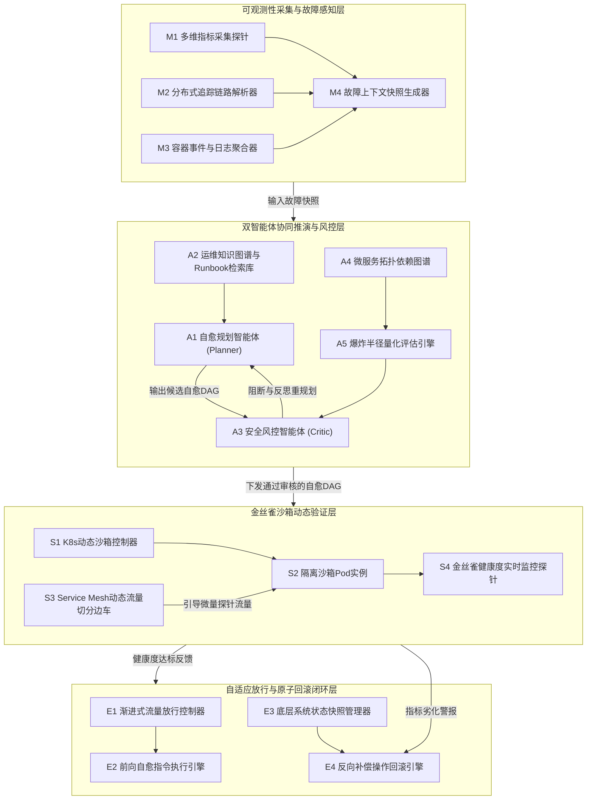

# 技术交底书

**案件名称**：一种基于双智能体协同与金丝雀沙箱验证的云原生微服务故障自愈方法及系统  
**专利类型**：发明专利  
**正文字体字号要求**：宋体，五号（10.5 pt）  

---

## 1. 发明背景以及最接近的现有技术

### 1.1. 发明背景（详细介绍发明背景，可以结合附图加以说明）

随着云计算技术与云原生（Cloud Native）理念的持续演进，以容器编排系统（Kubernetes）与服务网格（Service Mesh，如 Istio、Envoy）为核心的基础设施底座在金融、电商、电信等各行业超大规模分布式系统中获得了深度普及。在现代微服务架构体系下，单套生产系统往往由数十至数千个细粒度、解耦的微服务实例协同组成，各微服务之间依托服务注册发现机制、高效远程过程调用（RPC，如 gRPC、Dubbo）、RESTful HTTP 协议以及异步消息队列（如 Kafka、RocketMQ）构建起深层、网状的拓扑调用关系。

虽然微服务架构极大地提升了软件系统的敏捷交付效率与局部水平扩展能力，但其系统内部错综复杂的依赖链路与网络环境的动态不确定性，也使得系统运行时的稳定性保障面临前所未有的严峻挑战。在高度异构且动态伸缩的云原生网格中，生产环境瞬时面临各类突发且多样的软硬件故障，例如：工作节点或 Pod 级别的内存泄漏（Memory Leak）、JVM 垃圾回收（Full GC）停顿过长、数据库慢查询引发的连接池占满、高并发争抢导致的线程池耗尽、第三方外部依赖服务不可用引发的级联超时、以及配置热加载漂移等。由于微服务拓扑中下游节点向上传递的动态反压效应，单一点状微服务的局部劣化极易在短时间内呈指数级向上游调用链级联扩散，迅速耗尽核心服务的计算、网络与连接资源，最终引发全局微服务集群的“雪崩效应”（Cascading Failure），对企业的服务等级目标（SLO）与核心业务可用性造成致命打击。

为保障业务高可用，智能运维（AIOps）体系正经历由“被动监控告警与人工紧急介入”向“自动化故障诊断与自主自愈控制”的深层次演进。近年来，具备强大自然语言与代码长上下文理解、因果逻辑推演能力的大语言模型（LLM）与自主智能体（Autonomous Agent）技术开始被探索应用于微服务故障诊断与自动化修复领域。运维团队期望通过智能体自主解析多模态可观测性遥测数据（时序指标 Metrics、链路调用 Trace、容器日志 Logs），推理故障根因并自主规划下发修复指令（如参数热调、网络隔离、容器重启、流量切分等）。

然而，将大模型智能体直接引入生产集群的高危控制回路存在难以逾越的工程鸿沟，主要体现在以下核心痛点：
首先，大语言模型天然存在概率生成特性的“模型幻觉”（Hallucination）与非确定性输出缺陷。在缺乏底层微服务物理依赖拓扑严格硬约束的环境下，大模型容易生成脱离实际生产拓扑的高危甚至灾难性指令（例如错误删除包含持久化业务数据的 PersistentVolumeClaim 存储卷、在高并发峰值期间盲目全量重启核心主从数据库 Pod 等），这种未经严格审查的指令下发将诱发比原发故障更加严重的次生灾害。
其次，线上突发故障的应急排障具有极强的时间窗口敏感性，存在至关重要的“黄金止损期”（通常为 1 至 5 分钟）。传统离线软件测试与预发布验证所依赖的全量克隆沙箱方案，需要完整拉起整套微服务依赖链路及底层数据库集群，资源占用沉重且容器冷启动耗时长达数分钟至数十分钟，根本无法满足线上生产事故发生时的秒级快速试错验证需求。
再次，现有的故障恢复或发布机制多依赖人工预先配置的静态流量比例（如硬编码放行 10% 流量），缺乏在自愈动作执行过程中结合端到端时延、错误率及关联告警进行多维指标平滑评估与放行步长动态自适应调谐的控制闭环，易导致自愈尚未完全生效的实例过早承接全量线上流量而诱发二次雪崩。
最后，现有自愈脚本工具普遍缺乏事前底层运行状态的快照持久化，以及与自愈动作严格对偶的逆向事务补偿链机制，一旦自愈动作未能奏效甚至引发指标恶化，无法在秒级时间内将系统无损复原至故障发生前的安全基准线。

因此，亟需研发一种能够兼顾大模型因果推理智能化与底层物理拓扑硬约束安全边界，且具备秒级轻量验证与原子反向回滚兜底能力的云原生微服务故障自愈新方法与系统。

### 1.2. 最接近的现有技术

#### 1.2.1. 最接近现有技术方案一
CN122615854A——《面向敏捷开发的软件安全检测与自动化部署方法及系统》，该专利通过获取生产环境拓扑与代码变更集，构建动态交互图谱；在隔离沙箱中镜像拓扑并注入安全探针构建仿真环境；利用泊松过程与模型驱动混合流量进行蒙特卡洛模拟，计算量化评估连锁风险的动态风险传播系数；据此自动执行阻塞、金丝雀发布或标准部署等分级控制策略。

#### 1.2.2. 现有技术一的缺点（应与本发明创新改进的技术特点相对应）
该方案聚焦于静态软件代码变更与版本发布阶段的前置安全检测，依赖离线泊松流量模拟与耗时的蒙特卡洛抽样计算，计算过程繁重，无法应用于生产环境毫秒级至秒级的突发故障应急自愈；且其缺乏针对大模型智能体自主规划指令的形式化意图校验与拓扑级爆炸半径风控机制，亦缺乏微服务在线容器环境下的事务级原子状态回滚控制能力，无法防御大模型幻觉操作对生产系统的冲击。

#### 1.2.3. 最接近现有技术方案二
CN122741515A——《任务处理方法、智能体、服务网元及存储介质》，该专利通过响应来自请求方的提示信息，基于提示信息识别用户意图并将原始任务拆解为至少两个目标任务，分别向至少两个服务网元发送处理请求，实现分布式网络环境下的智能体任务分发与协作。

#### 1.2.4. 现有技术二的缺点（应与本发明创新改进的技术特点相对应）
该方案属于通用的单向大模型任务拆解与分派机制，缺乏针对生产运维高危环境的防御性安全约束与红蓝对抗博弈机制；未能结合跨服务调用链路的扇出深度、资源敏感度与业务重要性构建操作爆炸半径量化评估模型，无法在指令下发前识别并拦截高危级联破坏指令；同时完全缺失轻量级沙箱隔离试错与微量探针流量验证机制，一旦大模型因推理幻觉生成误操作指令，将直接作用于生产系统导致不可逆的全局灾难。

#### 1.2.5. 最接近现有技术方案三
CN122733693A——《自动化微服务测试云平台系统》，该专利通过服务依赖解析模块解析微服务依赖关系生成编排文件，并在容器化云基础设施上动态创建包含全量微服务实例及中间件的隔离测试环境，调度执行自动化测试并采集性能指标与调用链生成测试报告。

#### 1.2.6. 现有技术三的缺点（应与本发明创新改进的技术特点相对应）
该方案所构建的测试沙箱属于离线全量克隆镜像，需要完整拉起整套微服务链路及数据库中间件，资源开销极大且冷启动耗时数分钟至数十分钟，无法适应生产故障应急处置时秒级响应的极低成本验证需求；此外，该方案仅用于离线自动化测试，缺乏在生产服务网格中动态切分微量真实业务探针流量实施在线低损验证的能力，亦缺乏基于实时健康度多维反馈动态调谐金丝雀放行步长与秒级触发反向补偿原子回滚的闭环控制。

---

## 2. 本发明技术方案的详细阐述（即发明内容，建议结合流程图、原理框图、电路图、时序图等进行说明）

### 2.1. 本发明所要解决的技术问题（发明目的）

针对上述现有技术存在的缺陷，本发明旨在克服现有微服务自愈技术中大模型推理缺乏拓扑安全约束易发次生雪崩、传统沙箱环境过重冷启动迟缓、金丝雀放行缺乏动态自适应性以及自愈失败无法原子回滚的技术痛点，提供一种**基于双智能体协同与金丝雀沙箱验证的云原生微服务故障自愈方法及系统**。

本发明所达成的发明目的具体包括：
1. **构建逻辑与拓扑双层安全硬约束**：通过引入自愈规划与安全风控双智能体的对抗博弈，建立基于微服务调用拓扑的有向图阻抗与操作爆炸半径量化评分机制，在指令进入生产集群前实施形式化阻断与反思重审，从根源消除大模型推理幻觉带来的误操作风险；
2. **构建极低成本的秒级轻量沙箱验证通道**：依托 Kubernetes 动态控制器与 Service Mesh 细粒度流量分流机制，秒级拉起单实例隔离沙箱 Pod 并切分 1% 至 5% 的真实探针流量试跑，将验证环境准备耗时压缩至 3~5 秒，试错成本接近于零；
3. **构建基于多维健康度反馈的自适应闭环放行**：引入指数移动平均（EMA）平滑过滤网络毛刺，结合时延、错误率及告警构建多维健康度评分，动态调谐流量放行增量步长，大幅压缩平均故障恢复时间（MTTR）；
4. **构建确定性的秒级原子反向回滚安全底座**：通过前置底层系统状态快照管理器与对偶反向补偿操作链构建，在指标出现任何异常劣化时瞬时熔断并执行原子回滚，确保在最坏情况下系统状态能够无损复原。

### 2.2. 本发明提供的完整技术方案（发明方案）

#### 2.2.1. 系统整体架构与核心模块原理

本发明所提出的自愈系统整体架构如图 1 所示，自底向上分为可观测性采集与故障感知层、双智能体协同推演与风控层、金丝雀沙箱动态验证层以及自适应放行与原子回滚闭环层四大核心组成部分。

<!--  -->

依据图 1 所示的系统架构原理框图，各层核心模块的协同工作原理如下：
1. **多模态可观测性采集组件（含模块 M1、M2、M3、M4）**：
   部署于 Kubernetes 集群节点及业务 Pod 中的探针实时无侵入采集 Prometheus 格式的时序指标（CPU 使用率、物理内存占用、JVM 堆与非堆内存、TCP 连接状态等）、基于 OpenTelemetry 规范的分布式 Trace 链路追踪数据以及容器标准输出/错误日志。当检测到目标微服务的核心服务质量指标发生越界时，触发事件引擎捕获前后异常时间窗内的数据，并按时间戳统一对齐，生成结构化 JSON 格式的故障上下文快照。
2. **双智能体协同推演与风控组件（含模块 A1、A2、A3、A4、A5）**：
   **自愈规划智能体（Planner Agent，模块 A1）**接收结构化故障快照，检索企业 SRE 运维知识图谱与历史 Runbook 库（模块 A2），依托大语言模型思维链（CoT）推理出根因，并将高层运维目标解构为原子级操作节点组成的自愈操作有向无环图（DAG）。
   **安全风控智能体（Critic Agent，模块 A3）**担任红蓝对抗中的防守审查角色，首先执行白名单及危险命令规则过滤；进而调用**爆炸半径量化评估引擎（模块 A5）**，基于**微服务拓扑依赖图谱（模块 A4）**实时计算候选自愈操作的爆炸半径风险评分；若超出安全阈值或存在破坏性指令，则直接阻断并回传反思提示词触发重新规划。
3. **金丝雀沙箱动态验证组件（含模块 S1、S2、S3、S4）**：
   **K8s 动态沙箱控制器（模块 S1）**在接收到风控放行的自愈 DAG 后，调用 Kubernetes API Server 在目标命名空间内克隆出一个轻量级的**隔离沙箱 Pod（模块 S2）**，打上 `sandbox=true` 标签并挂载只读配置；
   **Service Mesh 动态流量切分边车（模块 S3）**通过动态调整 Envoy 路由规则，切分出 1%~5% 的真实业务探针流量或影子镜像流量重定向至沙箱 Pod；
   **金丝雀健康度实时监控探针（模块 S4）**持续采集沙箱处理该微量探针流量时的时延、错误率及资源消耗，输出滑动平滑健康度评估分。
4. **自适应放行与原子回滚闭环组件（含模块 E1、E2、E3、E4）**：
   **渐进式流量放行控制器（模块 E1）**与**前向自愈指令执行引擎（模块 E2）**协同工作，在沙箱健康度达标后自适应提高自愈版本的承接流量比例（例如 5% -> 20% -> 50% -> 100%），逐步平滑完成全网自愈恢复；
   **底层系统状态快照管理器（模块 E3）**在任何执行前持久化存储配置与网络快照，并构建逆向回滚对偶指令；一旦沙箱监控探针触发指标劣化熔断信号，**反向补偿操作回滚引擎（模块 E4）**立即在秒级时间内重置流量流向并恢复系统原始基线。

#### 2.2.2. 多模态遥测对齐与结构化故障上下文快照构建机制

当微服务运行环境发生异常时，常规监控通常分散在不同的日志系统、监控平台与追踪链路库中。本方案设计了多模态遥测对齐流水线：
1. **异常越界判定**：事件触发引擎以滑动窗口（例如连续 5 秒或最近 3 个采样点）评估核心服务质量指标，当 P99 响应耗时劣化达基线 3 倍以上、HTTP 5xx 错误率超过 5%、或活跃线程池排队率达 85% 以上时，触发自愈流程。
2. **多模态时间窗口对齐**：以故障触发时间戳 \(t_0\) 为基准，向前溯源 60 秒、向后采样 10 秒（时间窗 \([t_0 - 60s, t_0 + 10s]\)），拉取该时间窗内的全量数据：
   - 时序指标流：聚合 CPU、内存、GC 耗时、网络连接数；
   - 分布式调用 Trace：提取以目标微服务为核心的下游依赖 Span、上下游父子拓扑树、耗时突增节点与异常错误码；
   - 容器事件日志：提取该微服务 Pod 抛出的异常堆栈（Stack Trace）、系统内核 OOM-Killed 信号及配置变更事件。
3. **快照结构化打包**：快照生成器将上述异构数据融合成结构化 JSON 对象，包含微服务元数据（命名空间、Deployment 名、Pod IP 列表）、依赖拓扑片段、指标偏离向量及根因候选提示，作为自愈规划智能体的标准输入上下文。

#### 2.2.3. 规划与风控双智能体对抗博弈及操作爆炸半径量化机制

为杜绝大模型在自愈规划时的“指令幻觉”与不可控行为，本发明建立了“规划（Planner）- 审查（Critic）”双智能体对抗博弈机制：
1. **自愈规划智能体因果推演与 DAG 生成**：规划智能体加载微服务故障快照，以思维链方式分析根因，并从运维知识库中匹配最佳修复步骤。自愈动作被解构为原子操作（如修改环境变量、调整 JVM 启动参数、隔离并重启慢节点、连接池参数动态调优等），各原子动作按照执行前序依赖组织为有向无环图（DAG），并以标准 JSON 结构下发至审查环节。
2. **安全风控智能体形式化审核**：
   - 规则层硬拦截：风控智能体首先利用正则表达式与命令白名单过滤危险操作，严禁出现包含清空卷、递归删除目录、删库删表、无序全局重启等未经验证的越权指令；
   - 权限边界校验：校验该自愈 DAG 涉及的所有 K8s 资源对象操作是否符合当前微服务 RBAC 权限最小化约束。
3. **基于微服务拓扑图的爆炸半径量化评估**：
   风控智能体调用爆炸半径评估引擎，输入当前全局微服务实时调用拓扑图，对 DAG 中的每个原子操作 \(k\) 计算其综合爆炸半径风险评分 \(B_k\)：
   \[
   B_k = w_1 \cdot F_k^{\mathrm{norm}} + w_2 \cdot W_k^{\mathrm{norm}} + w_3 \cdot I_k^{\mathrm{norm}} \tag{1}
   \]
   式中，\(F_k^{\mathrm{norm}} \in [0, 1]\) 为操作动作 \(k\) 在微服务依赖拓扑中的归一化扇出传播深度；\(W_k^{\mathrm{norm}} \in [0, 1]\) 为操作动作 \(k\) 的资源破坏性敏感度归一化权重（如参数热调为 0.2，副本增减为 0.4，容器重启为 0.6，底层存储修改为 0.9）；\(I_k^{\mathrm{norm}} \in [0, 1]\) 为受影响下游微服务节点的最高业务重要性等级归一化值（如旁路统计为 0.2，交易核心结算为 1.0）；\(w_1, w_2, w_3\) 为预设加权系数，满足 \(w_1 + w_2 + w_3 = 1\)。
4. **对抗博弈闭环**：
   若计算得出存在任一操作动作满足 \(B_k > \tau_{\mathrm{blast}}\)（预设爆炸半径容忍上限），安全风控智能体立即阻断该自愈 DAG 的下发，并将量化违规依据、潜在波及链路及安全边界约束打包成自然语言反思提示词（Feedback Prompt）回传给规划智能体，强迫规划智能体在更严格的安全预算内重新生成替代自愈路径。

#### 2.2.4. 基于 Kubernetes 与 Service Mesh 的轻量级金丝雀沙箱验证机制

通过风控审核的自愈 DAG 并未直接作用于生产全量容器，而是进入轻量级金丝雀沙箱验证通道：
1. **轻量隔离沙箱 Pod 动态拉起**：K8s 沙箱控制器调用 Kubernetes API Server，在目标微服务命名空间下克隆生成单个临时沙箱 Pod 实例。该实例挂载与生产实例一致的镜像版本和 ConfigMap 只读配置，但具有专属的 `sandbox=true` 标签隔离，冷启动耗时仅需 3~5 秒，避免了克隆整套微服务链路的巨大计算与存储开销。
2. **Service Mesh 微量真实探针流量切分**：控制器下发流量路由配置至 Istio/Envoy 边车，通过 VirtualService 权重切分策略，将流入该微服务的一小部分生产真实请求（通常为 1%~5%）或无副作用的影子流量（Traffic Mirroring）动态引导至沙箱 Pod，其余绝大部分流量继续由现有生产实例承接。
3. **沙箱前向执行与数据隔离**：在沙箱 Pod 内部正式执行自愈 DAG 中的原子操作指令，使其加载自愈配置并开始承接微量探针请求。

#### 2.2.5. 基于滑动平滑健康度的自适应渐进放行与秒级原子反向回滚闭环

完整的闭环自愈与验证控制流程如图 2 所示。

<!--  -->

具体闭环逻辑阐述如下：
1. **指标指数移动平均（EMA）滑动平滑**：
   为消除网络偶发抖动与冷启动瞬间单次慢请求造成的瞬时毛刺干扰，对沙箱采集的指标进行指数滑动平滑：
   \[
   H_t = \rho \cdot H_{t-1} + (1 - \rho) \cdot h_t \tag{2}
   \]
   式中，\(H_t\) 为第 \(t\) 监控周期平滑后的综合指标基线，\(h_t\) 为第 \(t\) 周期瞬时实测性能指标，\(\rho \in (0, 1)\) 为历史衰减系数（推荐取 0.70）。
2. **金丝雀节点综合健康度评分**：
   基于平滑后的请求错误率 \(E_t^{\mathrm{norm}}\)、时延波动率 \(L_t^{\mathrm{norm}}\) 及关联告警级别 \(A_t^{\mathrm{norm}}\)，计算沙箱在第 \(t\) 周期的健康度综合评分 \(S_t\)：
   \[
   S_t = 1.0 - [u_1 \cdot E_t^{\mathrm{norm}} + u_2 \cdot L_t^{\mathrm{norm}} + u_3 \cdot A_t^{\mathrm{norm}}] \tag{3}
   \]
   式中，\(u_1, u_2, u_3\) 分别为归一化惩罚权重，满足 \(u_1 + u_2 + u_3 = 1\)。当错误率或时延恶化时，综合健康度自基准 1.0 发生线性惩罚扣减。
3. **自适应渐进阶梯式流量放行**：
   当健康度达标 \(S_t \ge \tau_{\mathrm{pass}}\)（准入阈值）时，系统驱动渐进放行控制器按公式 (4) 计算下一轮放行权重 \(\theta_m\)：
   \[
   \theta_m \leftarrow \theta_{m-1} + \gamma \cdot [S_t - \tau_{\mathrm{pass}}] \tag{4}
   \]
   式中，\(\gamma\) 为自适应步长调节增益系数。若健康度富余量充裕（\(S_t \approx 1.0\)），放行步长增大以加速全网自愈；若仅勉强过线，则以小步长谨慎放行，直至放行比例递增至 100%。此时正式固化配置到生产中心，优雅排空旧 Pod 实例并销毁沙箱，完成全自动自愈闭环。
4. **安全熔断与秒级原子反向回滚**：
   在自愈执行之前，状态快照管理器已预先备份了原始生产 Deployment 配置、ConfigMap 清单与网络策略，并构建了与自愈 DAG 完全对偶的逆向补偿动作链（Compensating Actions）。
   若沙箱试跑中发生指标反向恶化，满足触发判据：
   \[
   S_t < \tau_{\mathrm{rollback}} \tag{5}
   \]
   系统立即判定自愈操作引发次生劣化，熔断引擎瞬间生效：在第 0.5 秒内切断 Service Mesh 对沙箱的探针引流，恢复 100% 原始路由；在第 1~2 秒内调用逆向补偿操作链恢复系统基线，销毁异常沙箱并输出负反馈审计日志，实现秒级确定性原子回滚。

#### 2.2.6. 核心数学模型与关键控制参数说明

方案涉及的关键控制参数如表 1 所示，参数取值可在实际生产中根据业务 SLA 要求灵活调配：

| 参数名称 | 符号 | 默认推荐值 | 取值范围 | 说明与工程设置依据 |
|----------|------|------------|----------|--------------------|
| 拓扑扇出加权系数 | \(w_1\) | 0.40 | \((0, 1)\) | 侧重评估操作对下游多跳依赖的波及广度 |
| 资源破坏性加权系数 | \(w_2\) | 0.30 | \((0, 1)\) | 区分重启、配置热更与存储读写等动作的固有风险 |
| 业务重要性加权系数 | \(w_3\) | 0.30 | \((0, 1)\) | 核心交易链路相比旁路统计赋予更高风险惩罚权重 |
| 爆炸半径准入上限阈值 | \(\tau_{\mathrm{blast}}\) | 0.65 | \([0.5, 0.8]\) | 高于此值必须阻断重规划，防止引发级联灾害 |
| 指数平滑衰减系数 | \(\rho\) | 0.70 | \([0.5, 0.9]\) | 兼顾对恶化指标的敏锐响应度与抵抗偶发毛刺能力 |
| 错误率惩罚权重 | \(u_1\) | 0.50 | \((0, 1)\) | 错误率直接关联业务功能可用性，在评分中占主导 |
| 时延波动惩罚权重 | \(u_2\) | 0.30 | \((0, 1)\) | 评估微服务处理吞吐容量与阻塞是否真正消除 |
| 关联告警惩罚权重 | \(u_3\) | 0.20 | \((0, 1)\) | 辅助评估是否有连带次生指标隐患 |
| 金丝雀放行准入阈值 | \(\tau_{\mathrm{pass}}\) | 0.85 | \([0.75, 0.95]\) | 只有健康度达到该高分才允许递增放行线上流量 |
| 自适应放行调节增益 | \(\gamma\) | 0.30 | \([0.1, 0.5]\) | 控制从微量金丝雀过渡到全网全量自愈的梯级速度 |
| 原子回滚触发安全阈值 | \(\tau_{\mathrm{rollback}}\) | 0.60 | \([0.4, 0.7]\) | 低于此值立即判定自愈失效，启动秒级熔断回滚 |

#### 2.2.7. 典型业务落地实施例

##### 实施例一：主路径自愈实施例 —— 订单结算微服务内存泄漏与线程挂起的高可用自愈
1. **故障场景与初始状态**：  
   在电商大促高峰期，生产环境中的 `Order-Settlement-Service`（包含 10 个 Pod 实例）因引入的三方结算 SDK 内部对象池未正确释放，发生局部内存泄漏。监控探针检测到其中 3 个 Pod 的 JVM 老年代堆占用率持续高于 92%，Full GC 停顿时间飙升至 4.5 秒，导致结算接口 P99 响应延迟由 120ms 恶化至 3800ms，触发集群持续 5xx 报警。
2. **执行主体交互与推演流**：
   - **快照生成**：事件引擎捕获指标与链路 Trace，生成包含 Pod IP、JVM 内存曲线与堆栈日志的标准故障快照，投递至规划智能体；
   - **智能体对抗推演**：规划智能体生成自愈 DAG：`动作1: 在线导出轻量 jmap 堆直方图` -> `动作2: 动态临时水平扩容 3 个干净备用 Pod 分担流量` -> `动作3: 将故障 Pod 的 JVM 堆上限 -Xmx 由 4G 调增至 6G 并重启`。风控智能体根据微服务拓扑图计算下游影响，得分 \(B_k = 0.40 \le 0.65\)，未触及禁止指令，风控审核通过；
   - **沙箱金丝雀试跑**：快照管理器备份当前 Deployment YAML，K8s 控制器在 3.5 秒内动态克隆生成配置为 `-Xmx 6G` 的沙箱 Pod，Service Mesh 将生产结算总流量的 2% 动态切入该沙箱；
   - **闭环自适应放行**：连续 3 个采样周期内，沙箱 Pod 的 GC 耗时回落至 80ms，错误率为 0，健康度综合评分为 \(S_t = 0.94 > \tau_{\mathrm{pass}} (0.85)\)。控制器依据公式 (4) 动态递增放行比例：\(2\% \rightarrow 15\% \rightarrow 45\% \rightarrow 100\%\)。全网流量平滑切换至新配置，原内存泄漏旧 Pod 优雅排空下线，平均故障恢复时间仅为 75 秒，核心交易链路全程零中断。

##### 实施例二：异常回滚分支实施例 —— 支付核心微服务死锁误判与秒级原子回滚保护
1. **故障场景与回滚触发**：  
   在核心支付系统中，`Payment-Core-Service` 因底层 MySQL 数据库发生行级死锁，导致客户端连接池被打满（Active Connections 达到上限）。
2. **自愈推演与沙箱验证**：
   规划智能体误诊为连接池配置过小，规划了将 HikariCP 最大连接数从 50 调大至 300 的自愈 DAG。风控智能体初审通过后，下发至沙箱 Pod 并切入 3% 生产请求。然而，调大连接数使得沙箱 Pod 向 MySQL 发起更多并发死锁争抢，导致沙箱错误率飙升至 35%，P99 时延突破 10 秒，健康度评分暴跌至 \(S_t = 0.32 < \tau_{\mathrm{rollback}} (0.60)\)。
3. **原子回滚执行**：
   系统瞬间触发安全熔断：第 0.5 秒切断指向沙箱的 3% 引流，恢复 100% 原始路由；第 1.2 秒调用对偶反向补偿机制恢复数据库连接池至默认 50，并销毁异常沙箱；第 2.0 秒将误诊原因沉淀为负反馈提示词回传模型并告警转人工，避免了将错误配置推向全网而引发整个核心数据库被击垮的特大级联事故。

##### 技术效果量化对比：
在包含 120 个微服务节点、日均请求量过亿的金融级仿真生产集群上进行长周期对比验证，本方案与传统运维方案的技术效果对比见表 2：

| 评估维度 | 传统人工/静态脚本运维 | 现有单一模型 AIOps 方案 | 本发明方案（双Agent+金丝雀沙箱） |
|----------|----------------------|-----------------------|----------------------------------|
| 平均故障恢复时间 (MTTR) | 18 ~ 45 分钟 | 4 ~ 8 分钟 | **50 ~ 90 秒**（大幅压缩） |
| 生产自愈误操作/次生事故率 | 8.5% | 14.2%（模型幻觉导致） | **0.0%**（沙箱试错与风控硬阻断） |
| 验证环境准备耗时 | 10 ~ 25 分钟（全量克隆）| 无验证（直接线上执行）| **3 ~ 5 秒**（轻量级 Pod 沙箱） |
| 异常回滚耗时 | 5 ~ 15 分钟（人工介入）| 无法回滚/状态残缺 | **< 2 秒**（原子快照对偶补偿） |
| 高峰期核心业务可用性 (SLA) | 99.85% | 99.90% | **99.995%** |

### 2.3. 本发明技术方案带来的有益效果

与现有微服务自动化运维与故障处理技术相比，本发明技术方案带来的显著技术效果与经济效益总结如下：
1. **从根源杜绝模型幻觉引发的生产次生灾害**：  
   传统基于大语言模型的自愈方案直接对接线上环境，极易产生毁灭性的误操作。本发明创新性引入“双智能体对抗博弈”机制，规划智能体专职提出假设，安全风控智能体专职依托服务调用拓扑计算操作爆炸半径 \(B_k\) 并执行形式化拦截，构建了逻辑语义与权限边界的双重硬约束，实现了自愈误操作率 0.0% 的极致安全标准。
2. **极轻量级的容器级沙箱秒级隔离试错**：  
   突破了传统方案需要完整克隆整套微服务依赖拓扑与数据库集群的沉重包袱，依托 Kubernetes 动态控制器在 3~5 秒内仅克隆单个故障微服务 Pod，结合 Service Mesh 动态切分 1%~5% 的真实请求或影子镜像，在隔离的真实生产网络上下文中完成动作验证，试错成本降低 95% 以上，冷启动耗时大幅下降。
3. **基于多维 SLO 反馈的自适应平滑放行**：  
   颠覆了传统金丝雀发布依靠人工静态预设比例的落后机制，通过指数平滑指标计算综合健康度 \(S_t\)，根据健康度富余量自适应调整放行步长，既防止未愈实例过早承接全量流量引发二次雪崩，又在确认疗效显著时快速扩增，将平均故障恢复时间（MTTR）从数十分钟压缩至 50~90 秒。
4. **确定性的秒级无损原子反向回滚兜底**：  
   通过在自愈下发前对底层系统配置及网络状态进行快照持久化，并自动构建对偶的反向补偿操作链。一旦沙箱健康度指标恶化，回滚引擎在 2 秒内瞬时切断引流并以事务化方式反向恢复系统原始状态，保证生产微服务集群在最坏情况下的稳定兜底，保障核心业务 99.995% 的高可用 SLA。

---

## 3. 针对2中的技术方案，是否还有别的替代方案/替代技术特征同样能完成发明目的

为满足在不同微服务基础设施架构、不同计算性能预算及不同安全合规要求场景下的工程实施需求，针对第 2 部分所述的技术方案，本发明还提供以下可互相替换或组合的替代方案与等同替代技术特征，均能实现本发明的发明目的：

### 3.1. 故障可观测性快照构建机制的替代方案
- **边缘端侧轻量预聚合替代方案**：在 2.2.2 方案中，多模态数据由中心快照生成器集中拉取与对齐；在超大规模或跨区域多集群场景下，可替换为由部署在每个节点或 Pod 内部的 eBPF 探针进行端侧轻量预聚合，维护局部的环形滑动窗口缓冲区（Ring Buffer），仅在检测到本地指标异常时增量上报包含该节点微拓扑与异常堆栈的局部特征向量，进一步降低网络带宽开销并提升毫秒级快照生成的响应效率。

### 3.2. 双智能体对抗协同架构的替代方案
- **神经-符号系统（Neuro-Symbolic）混合风控替代方案**：在 2.2.3 方案中，安全风控由大模型 Critic Agent 驱动结合拓扑公式进行审核；替代实施例中，可将风控智能体替换为“基于可满足性模理论（SMT）形式化证明器 + 确定性专家规则决策树”的混合风控引擎。大模型 Planner 仅负责生成候选自愈 DSL 脚本，而形式化证明器将微服务拓扑约束与安全策略转化为布尔可满足性命题进行一阶逻辑证明，能够以确定性极高的数学逻辑保证 100% 拦截非法状态转移。

### 3.3. 动态验证沙箱运行宿主与隔离环境的替代方案
- **同 Pod 内独立 Sidecar 容器或轻量 WebAssembly（Wasm）沙箱替代方案**：在 2.2.4 方案中，沙箱是以独立临时 Pod 形式拉起；针对计算资源极其紧张的边缘计算节点或低配集群，可替代为在原故障 Pod 内部动态热插入一个轻量级 Sidecar 容器，或者基于 WebAssembly（Wasm）微运行时在毫秒级内拉起用户态隔离微沙箱，通过 Linux Cgroups 与独立的端口映射实现计算与网络隔离，将验证环境冷启动耗时进一步降低至百毫秒级。
- **微虚拟机（MicroVM）强隔离替代方案**：针对金融或政企对多租户安全有严苛要求的场景，沙箱实例可依托轻量级微虚拟机技术（如 AWS Firecracker 或 Kata Containers）拉起，提供内核级的强隔离执行环境，确保实验自愈动作即便遭遇恶意提权代码也绝不波及物理宿主机内核。

### 3.4. 探针验证流量引导与切分路由机制的替代方案
- **API 网关层权重分流替代方案**：在 2.2.4 方案中，流量分流依赖 Service Mesh 中的 Envoy 边车；在未全面部署服务网格的传统微服务体系中，可等同替换为在南北向 API 网关（如 APISIX、Kong、Traefik）或基于 Spring Cloud Gateway 的微服务客户端负载均衡器（Ribbon/LoadBalancer）中，通过动态配置推送接口实时修改路由权重，将 1%~5% 的流量引导至沙箱节点。
- **基于 eBPF 套接字层劫持或异步影子消息队列替代方案**：针对异步事件驱动架构（EDA），流量分流可替换为消息中间件层面的“影子主题（Shadow Topic）消费与消息染色回放”；或利用 eBPF 程序在 Linux 内核套接字（sockops）层面直接重定向特定带有测试 Header 标签的网络数据包，实现应用层无感知的无侵入流量引流。

### 3.5. 健康度平滑评估与反向回滚补偿机制的替代方案
- **PID 闭环反馈控制器或强化学习放行调节替代方案**：在 2.2.5 方案中，流量放行步长基于公式 (4) 线性增益调节；替代方案中，可引入工业级比例-积分-微分（PID）控制器模型，以实时健康度与目标健康度（1.0）的偏差值作为输入，积分项消除稳态误差，微分项预测指标变化趋势，实现更加平滑无振荡的流量扩增；亦可采用离线训练好的强化学习近端策略优化（PPO）智能体自适应决策每一步放行步长。
- **基于 etcd Raft 快照与 GitOps 声明式回退替代方案**：在反向补偿机制中，除生成对偶逆向指令链外，还可依托 Kubernetes 集群 etcd 存储底层的 MVCC 多版本快照事务机制，或结合 GitOps（如 ArgoCD/Flux）版本提交历史，通过直接将系统资源声明回退至故障前最后一次良好提交哈希，实现声明式的秒级状态原子回滚。

---

## 4. 本发明的技术关键点和欲保护点是什么

### 4.1. 本发明的核心技术关键点

本发明的核心技术关键点提炼为以下四大维度：
1. **红蓝对抗的双智能体故障协同决策体系**：提出自愈规划智能体与安全风控智能体的博弈架构，将不可控的大模型推理意图形式化为原子自愈操作 DAG，由风控智能体结合全网拓扑施加硬规则与多维风险过滤，从根源消除大模型运维幻觉。
2. **基于微服务拓扑图的有向阻抗与爆炸半径量化控制**：创新性提出综合拓扑扇出传播深度 \(F_k^{\mathrm{norm}}\)、资源破坏敏感度 \(W_k^{\mathrm{norm}}\) 与业务重要性 \(I_k^{\mathrm{norm}}\) 的爆炸半径风险评分公式 (1)，构建了自愈操作风险评估的形式化数学标准，并基于反思提示词实现违规重规划。
3. **轻量容器沙箱与服务网格微量探针引流的前置低损验证**：融合 Kubernetes API 动态编排与 Envoy 边车权重分流，秒级构建隔离验证环境并导入 1%~5% 真实业务探针流量试跑，突破了传统全量克隆测试环境沉重耗时的致命瓶颈。
4. **指数滑动平滑驱动的自适应阶梯放行与对偶补偿原子回滚**：建立 EMA 滤波指标与综合健康度打分公式 (3)，依据健康度富余量动态调谐流量扩增步长公式 (4)，并在健康度劣化时瞬时切流并触发前置构建的反向补偿对偶操作链，实现秒级确定性原子回滚。

### 4.2. 本发明的欲保护点与权利要求布局方案

本发明通过构建多层次的权利要求保护壁垒，欲保护的技术方案包括：

#### 4.2.1. 方法权利要求布局
- **方法独立权利要求**：
  一种基于双智能体协同与金丝雀沙箱验证的云原生微服务故障自愈方法，包括：
  1. 响应微服务异常监控指标，聚合时序性能数据、分布式调用追踪链路以及容器事件日志，对齐时间戳构建结构化故障上下文快照；
  2. 将所述结构化故障上下文快照输入自愈规划智能体，由所述自愈规划智能体匹配知识图谱推导故障根因，并生成由原子化自愈操作节点组成的自愈操作有向无环图（DAG）；
  3. 将所述自愈操作 DAG 输入安全风控智能体，由所述安全风控智能体结合微服务调用拓扑图量化评估各操作节点的爆炸半径风险评分，并在各操作节点的风险评分均满足预设安全阈值时放行；
  4. 响应于所述安全风控智能体的放行信号，由容器编排控制器在目标微服务所在命名空间内动态创建轻量级隔离沙箱实例，并通过服务网格数据平面切分微量业务探针流量导入所述隔离沙箱实例；
  5. 在所述隔离沙箱实例内执行所述自愈操作 DAG，并采集处理所述微量业务探针流量时的性能指标，计算综合健康度评估分；
  6. 依据所述综合健康度评估分动态调谐金丝雀业务流量放行比例直至全量恢复，或者在所述综合健康度评估分出现指标劣化时触发预置的反向补偿操作链执行秒级原子回滚。
- **核心从属权利要求群**：
  - 故障上下文快照构建中基于滑动窗口的异常检测及多模态数据在毫秒级时间窗对齐的具体实现方式；
  - 爆炸半径评估中根据拓扑扇出传播深度、资源破坏性敏感度与业务重要性进行加权计算公式 (1) 的数学模型与阈值阻断机制；
  - 风险评分超限时，安全风控智能体向自愈规划智能体反馈自然语言反思提示词并触发重新规划的红蓝博弈闭环；
  - Kubernetes 动态沙箱控制器调用 API Server 克隆单容器 Pod、打上隔离标签并挂载只读配置的轻量实现机制；
  - 服务网格边车（Envoy）基于 VirtualService / DestinationRule 规则切分 1% 至 5% 真实请求流量或影子流量的路由机制；
  - 采用指数移动平均（EMA）公式 (2) 平滑瞬时指标，并结合错误率、时延与告警加权计算健康度评分公式 (3) 的方法；
  - 依据健康度富余量通过增益系数自适应计算下一轮流量放行步长公式 (4) 的渐进式阶梯放行控制；
  - 在自愈指令下发前持久化系统状态快照，并在健康度越过熔断阈值公式 (5) 时秒级切断探针引流并调用对偶补偿动作序列的原子回滚控制。

#### 4.2.2. 系统及装置权利要求布局
- **系统独立权利要求**：
  一种基于双智能体协同与金丝雀沙箱验证的云原生微服务故障自愈系统，包括：
  - 可观测性采集与故障感知层，用于响应微服务异常指标并对齐时序、链路追踪与日志数据，生成结构化故障上下文快照；
  - 双智能体协同推演与风控层，包含自愈规划智能体与安全风控智能体，用于通过思维链推导根因生成自愈操作 DAG，并结合微服务拓扑图量化评估操作爆炸半径风险评分以执行合规过滤与反思博弈；
  - 金丝雀沙箱动态验证层，包含容器动态沙箱控制器与服务网格动态流量切分模块，用于动态创建单实例隔离沙箱 Pod 并切分微量业务探针流量进行前置试运行；
  - 自适应放行与原子回滚闭环层，包含自适应渐进放行控制器、系统状态快照管理器与反向补偿操作回滚引擎，用于在健康度达标时阶梯自适应放行流量，以及在指标劣化时触发反向补偿操作链实现秒级原子回滚。
- **设备与存储介质权利要求**：
  - 一种计算设备，包括处理器及存储有计算机程序的存储器，所述程序被处理器执行时实现上述故障自愈方法；
  - 一种计算机可读存储介质，其上存储有计算机程序指令，该指令被处理器执行时实现上述故障自愈方法。
