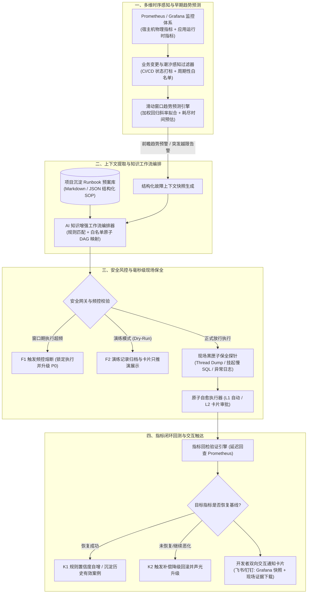
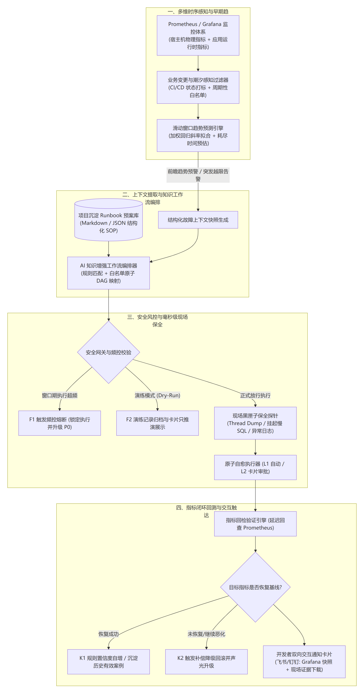

# 专利交底书：基于多维指标趋势预测与知识增强工作流的系统故障自愈方法及系统

---

## 1. 发明背景以及最接近的现有技术

### 1.1. 发明背景
随着分布式架构、云原生体系以及微服务技术的纵深演进，现代企事业单位的核心业务系统普遍向容器化编排环境（如 Kubernetes 容器集群）进行深度迁移。在此类高并发、高弹性以及高分布式的业务环境下，单一业务请求往往需要跨越网关路由层、前端聚合层、核心领域服务层以及底层持久化数据源等数十个微服务节点，形成拓扑复杂、动态演进的有向调用网络。

为了保障此类分布式业务系统的稳定性与可用性，以 Prometheus、Grafana 为代表的时序监控度量平台以及配套的 Node Exporter、Micrometer 等指标暴露组件，已成为现代云原生基础设施的标准组件。该类监控系统能够实时、高频地采集底层宿主机硬件指标（包括中央处理器利用率、多核平均负载、物理空闲内存、磁盘 I/O 读写饱和度、网络 TCP 重传与丢包率等），以及项目应用运行时核心技术指标（包括 Java 虚拟机 JVM 堆与非堆内存占用率、垃圾回收 GC 停顿频率与单次耗时、数据库连接池活跃连接数与等待排队深度、对外 API 接口的 HTTP 5xx 错误率与 P99 响应延迟等）。

然而，现有的自动化运维与故障处理体系在生产实践与工程落地中，依然存在若干深层次的技术瓶颈与矛盾冲突。

首先，传统监控系统的告警逻辑严重滞后，本质上处于被动事后告警状态。现有系统普遍采用针对单项物理指标的静态硬阈值报警策略，例如设定当 CPU 使用率超过 85% 或内存使用率超过 90% 且持续若干分钟后触发报警。然而在分布式高并发生产环境中，当物理资源指标越过硬性临界阈值时，底层的服务雪崩往往已经形成，数据库连接池通常已彻底耗尽，上下游微服务亦已伴随产生大面积请求级联超时。由于缺乏对指标变化速率与恶化趋势的前瞻性推演计算，运维团队与自愈程序只能在事故发生后介入处理，使得系统平均修复时间居高不下。

其次，业务团队日常沉淀的运维经验难以与自动化自愈体系形成有机联动。各个业务开发团队在长期维护具体项目的过程中，针对自身业务特异性沉淀了大量的排障预案与故障恢复规程。但在现有技术架构中，这些宝贵的经验通常以非结构化的离线文档或研发人员个人隐性经验的形式存在，无法被监控系统实时调用。而若直接引入缺乏上下文约束的大模型生成通用运维脚本，在没有严格权限边界与参数白名单约束的情况下直接对生产环境执行底层操作，极易产生高危误操作或越权删除指令，导致次生事故。

再次，现有的破坏性自愈手段普遍破坏了故障现场的瞬态关键证据。在生产运维中，常见的自愈手段多为针对容器实例的强制重启、销毁重建或服务下线。此类操作在暂时掩盖线上表象问题的同时，瞬间销毁了发生故障时的进程内存堆转储快照、当前活跃线程的死锁栈追踪、以及处于未提交状态的慢 SQL 现场上下文。这导致研发团队在后续的复盘排查中彻底丢失犯罪现场证据，无法准确定位代码级的内存泄漏点或并发死锁缺陷，致使同类故障反复在线上爆发。

最后，现有的自愈系统缺乏完备的防抖频控熔断防线以及渐进式演练放行机制。当系统遭遇由于代码硬缺陷、配置错误或依赖底层中间件永久不可用所引发的确定性故障时，自动化自愈流水线往往会陷入反复报错、反复自动重启的死循环，不仅无法恢复业务，反而会产生海量连带报警风暴，并对宿主机节点造成二次计算资源冲击。此外，由于现有的自愈系统缺乏一种能够在真实生产环境中只推演不执行的演练模式，业务团队对自动化自愈工具普遍缺乏信任，导致自愈策略长期停留在纸面无法在生产环境上线运行。

针对上述多项制约现代云原生软件系统稳定性的技术难题，本发明提出了一种兼具早期前瞻趋势拟合、项目特异性经验知识映射、毫秒级诊断现场保全、防抖频控熔断保护以及演练闭环验证的系统故障自愈方法及架构。

---

### 1.2. 最接近的现有技术

#### 1.2.1. 最接近现有技术方案一
`CN115883409A——《微服务云环境下的多类型指标相融合异常检测方法及装置》，该专利通过收集系统指标、日志和调用链等多类型监控数据，利用时序特征与图关联分析构建多模态指标相融合的异常判别模型；`

#### 1.2.2. 现有技术一的缺点
对比方案一所公开的技术虽然综合了指标、日志与调用链的多模态数据，并在异常状态判别上进行了图关联挖掘，但其核心逻辑依然停留在异常发生之后的检测与报警阶段，未设立基于时序滑动窗口的前瞻性消耗速率拟合机制，无法根据当前资源恶化斜率推算出物理资源耗尽的剩余前瞻时间，无法实现系统故障的主动预防。

同时，该方案的技术流程在输出异常检测结果后即告终结，未打通后续的自愈执行链路，无法自适应调取业务项目所沉淀的结构化故障预案并编排为具体的自愈操作流。

此外，该方案在监控分析过程中未设计在系统环境发生状态重置前的瞬态现场保全机制，无法在保护服务可用性的同时自动抓取高价值的代码级诊断快照。

#### 1.2.3. 最接近现有技术方案二
`CN114363149B——《故障处理方法及装置》，该专利通过在监测到业务服务故障时获取故障信息，基于历史故障信息及其对应的处理链路构建预设故障推理链路集合，并利用该集合对当前故障进行自动化处理；`

#### 1.2.4. 现有技术二的缺点
对比方案二主要依赖于对历史已有故障案例及其处理链路的预设集合进行特征匹配，方案呈现出强烈的静态规则匹配特性，难以应对由于业务代码动态变更、运行环境参数漂移所引发的渐进式性能衰退或未知复合型故障。

更为关键的是，该方案在执行自愈处理链路时直接下发执行指令，缺乏在破坏性自愈动作执行前的毫秒级上下文快照保全设计，导致目标节点在执行重启或切流时，核心的线程挂起堆栈与慢查询上下文被同步销毁，阻断了开发人员对故障根因的逆向溯源。

另外，该方案未设立针对自愈执行频次的滑动时间窗口防抖与熔断机制，在遭遇不可自愈的代码逻辑死锁时，容易引发针对容器实例的反复重启循环，甚至诱发分布式集群的级联雪崩。

#### 1.2.5. 最接近现有技术方案三
`CN115604086A——《监控报警故障自愈方法、装置、设备、介质和程序产品》，该专利在接收到报警信息后，根据该节点及其依赖节点和被依赖节点的报警事件更新各节点故障权重，确定根因节点并生成自愈方案执行修复；`

#### 1.2.6. 现有技术三的缺点
对比方案三立足于接收到报警信息之后通过更新调用链节点的故障权重来推演根因节点并生成自愈方案，但其完全基于事后报警驱动，缺乏在指标处于缓慢恶化爬坡阶段的前瞻性预警与前置自愈介入能力。

该方案未考虑实际业务运维中高频出现的业务发布部署（CI/CD）以及周期性定时大批量跑批场景，在上述特定维护窗口期内，拓扑权重的计算容易受到正常的流量脉冲与容器滚动更新干扰，进而引发严重的自愈误动作。

此外，该方案缺乏面向生产落地的演练沙箱机制，无法在正式下发自愈动作前提供只观察推演的试运行模式，且自愈执行后未建立针对物理指标恢复状态的延时闭环回测机制，无法形成知识库置信度自适应更新的闭环链路。

---

## 2. 本发明技术方案的详细阐述（发明内容）

### 2.1. 本发明所要解决的技术问题（发明目的）
针对现有监控报警体系在云原生与微服务架构落地中所暴露出的响应滞后、现场证据灭失、自愈频控缺失诱发二次灾害、业务发布期误报误治严重以及团队信任阻力大等技术缺陷，本发明旨在提供一种基于多维指标趋势预测与知识增强工作流的系统故障自愈方法及系统。

本发明旨在通过时序指标滑动窗口的消耗速率拟合，实现从传统的事后被动救火向事前主动预防的跨越，在物理资源即将耗尽的前瞻窗口期内提前介入。

本发明旨在通过设立毫秒级黑匣子诊断证据保全机制，在下发破坏性自愈指令之前完成线程堆栈、慢查询与错误日志的无损留存，化解服务快速恢复与故障根因追溯之间的矛盾。

本发明旨在通过将项目特异性沉淀的结构化 Runbook 转化为标准化原子操作有向无环图，并结合防抖频控熔断与演练沙箱模式，确保故障自愈过程严格受控、杜绝死循环误操作，实现兼具高可用性与高信任度的自动化运维落地闭环。

---

### 2.2. 本发明提供的完整技术方案（发明方案）

#### 2.2.1. 系统整体架构与组件协同流程
本发明系统由全态时序指标感知模块、业务变更与潮汐感知抑制模块、滑动窗口趋势预测引擎、毫秒级现场黑匣子保全探针、知识增强自愈工作流引擎、安全风控与频控熔断网关、指标回检验证引擎以及开发者双向交互触达模块协同构成。

系统的工作流遵循严密的技术闭环：首先通过时序采集通道拉取宿主机与应用进程指标，经过发布状态与周期性潮汐过滤后，送入时序趋势拟合引擎；若算法计算得出关键资源消耗速率持续为正且将在预设时间窗口内耗尽资源，则提前触发自愈工作流；工作流引擎结合结构化预案库生成由白名单原子操作构成的任务图；在执行破坏性动作前，守护探针毫秒级并发抓取当前进程的最小必要诊断上下文并持久化归档；经过频控熔断与演练模式校验放行后下发原子动作；动作完成后延迟探测指标基线是否恢复正常，并向开发者终端推送集成走势快照、现场证据下载链接与控制按钮的富文本卡片。

系统整体拓扑与数据闭环交互流程如下附图所示：

<!--  -->

#### 2.2.2. 全态多维时序指标感知与业务变更感知抑制
本方案在底层依托标准 Prometheus 采集端，以预设采集步长（如 15 秒）并发轮询采集两类异构指标数据源：

第一类为宿主机物理资源层指标，包括但不限于宿主机 CPU 利用率 `node_cpu_seconds_total`、系统一分钟/五分钟多核平均负载 `node_load1` 与 `node_load5`、可用物理内存百分比 `node_memory_MemAvailable_bytes`、磁盘 I/O 写入饱和时间比率 `node_disk_io_time_seconds_total`、以及网络网卡 TCP 重传率 `node_netstat_Tcp_RetransSegs`。

第二类为项目应用软件层运行时指标，包括但不限于 JVM 年轻代与老年代堆内存占用量 `jvm_memory_used_bytes`、老年代垃圾收集 Full GC 累计频次与单次停顿持续时间 `jvm_gc_pause_seconds`、数据库连接池 HikariCP 或 Druid 的活跃连接数 `hikaricp_connections_active` 与排队挂起线程数 `hikaricp_connections_pending`、对外核心 API 接口的 HTTP 5xx 错误率与 P99 响应耗时时延。

为了彻底消除日常运维中由于发版变更和周期性定时批处理所导致的指标异常误报，本发明设立了业务变更感知过滤通道。系统对外提供标准 Webhook 接收端点，与持续集成与部署（CI/CD）流水线（如 Jenkins、GitLab CI 或 ArgoCD）实现联动。当研发团队触发应用重新打包或滚动更新时，发布平台向本系统发送变更打标事件，系统自动在目标服务的元数据字典中注入带有有效生存期（TTL）的 `In-Deployment` 瞬态维护标签，并开启预设时长的发布免扰时间窗口（通常设置为构建开始至滚动发布完成后 300 秒）。在此免扰窗口期内，预测引擎自动调低指标突增的报警灵敏度，并强制阻断针对该服务任何破坏性自愈指令（如实例强制下线、容器重启等）的自动下发，仅允许进行非破坏性状态观测。此外，系统通过读取系统定时任务调度日历，对已知周期性发生的大促预热或凌晨固定报表批处理任务时间段，自动切换为大流量专用动态基线，避免正常峰值触发误治。

#### 2.2.3. 滑动窗口趋势拟合与早期前瞻预测算法
针对具有渐进式劣化特征的系统资源（如内存逐渐泄漏、慢查询累积导致数据库连接池被占满），本发明通过时序滑动窗口进行加权斜率外推与资源耗尽时间推算。

针对任意待测关键资源指标 $X$，系统在内存环形缓冲区中动态维护其最近 $W$ 个采样时刻的时序数据点对：
$$\{ (t_1, x_1), (t_2, x_2), \dots, (t_W, x_W) \}$$

为了使预测结果更加敏锐地反映最新突发恶化态势，同时平滑历史早期随机波动，本发明引入时间指数衰减权重因子 $w_i$：
$$w_i = \exp(-\lambda (t_W - t_i))$$
其中 $\lambda > 0$ 为时间敏感度衰减系数，$t_W$ 为滑动窗口内的最新当前采样时间戳。

系统采用一元加权线性回归计算该关键指标在当前时间段内的消耗速率斜率 $k$：
$$k = \frac{\sum_{i=1}^W w_i (t_i - \bar{t})(x_i - \bar{x})}{\sum_{i=1}^W w_i (t_i - \bar{t})^2}$$
其中 $\bar{t}$ 与 $\bar{x}$ 分别表示时间戳与指标观测值在加权条件下的均值：
$$\bar{t} = \frac{\sum_{i=1}^W w_i t_i}{\sum_{i=1}^W w_i}, \quad \bar{x} = \frac{\sum_{i=1}^W w_i x_i}{\sum_{i=1}^W w_i}$$

已知该项系统资源存在物理安全运行上限阈值 $X_{\max}$（例如数据库连接池最大允许连接数 $C_{\max}=50$），若计算得到的消耗速率 $k > 0$，则表明资源正处于持续恶化消耗状态。系统据此计算该资源距离彻底耗尽的剩余前瞻时间 $\Delta T_{\mathrm{exhaust}}$：
$$\Delta T_{\mathrm{exhaust}} = \frac{X_{\max} - x_W}{k}$$

系统设立双模态触发判据：
在主动预防模态下，当消耗速率 $k > 0$ 且计算得到的剩余前瞻时间 $\Delta T_{\mathrm{exhaust}} \le T_{\mathrm{warn}}$（例如设定预警前瞻时间窗为 300 秒），且当前指标绝对值已突破基线安全水位（如当前连接池占用已超过 70%），即使系统尚未产生任何 HTTP 5xx 错误、亦未达到常规静态告警线，系统依然立即判定系统处于早期微崩塌阶段，超前激活自愈工作流编排管道。
在被动应急模态下，若由于网络中断或突发百万级瞬时脉冲导致指标在短于采样窗口的时间内瞬间越过硬性故障阈值，系统由突发指标越限事件瞬时直接触发应急抢救工作流。

#### 2.2.4. 破坏性自愈前的毫秒级黑匣子证据保全
针对业界普遍存在的自愈操作破坏故障犯罪现场的技术难题，本发明提出并实现了毫秒级无损现场证据保全探针机制。

当自愈工作流引擎评估生成的自愈方案中包含有状态重置型操作（如容器强制滚动重启、本地内存缓存整体逐出、强制中断数据库活跃连接等破坏性动作）时，系统自动在指令正式下发至底层运行时的前置 500 毫秒至 2 秒保护窗口内，向部署在目标节点宿主机或容器 Sidecar 上的轻量守护进程下达证据保全指令。

守护探针通过本地轻量通信通道无侵入式并发捕获当前服务进程的最小必要瞬态诊断上下文，抓取动作限定在严格的超时保护内完成，避免影响系统自愈时机。抓取内容具体涵盖三个维度：
第一维度为线程栈快照，通过挂载 JVM 进程或发送系统信号，提取当前瞬时占用 CPU 时间最高的前 30 个工作线程的完整堆栈跟踪调用链路（Thread Dump），以明确是否存在长事务阻塞、死锁争用或耗时算法循环。
第二维度为慢查询上下文，通过调用应用暴露的管理端点或数据库连接池内置拦截切面，并发抓取连接池当前处于活动挂起（Active Running）状态且耗时排名前 10 的 SQL 文本、绑定参数哈希以及已执行毫秒数。
第三维度为应用上下文错误日志，通过直接调阅容器运行时的环形标准错误输出缓冲区，切片截取故障触发前最近 300 行带有 `ERROR` 或 `EXCEPTION` 标识的原始日志文本。

探针将抓取到的上述三维诊断数据在本地内存中进行高效流式 gzip 压缩，打包生成带有时间戳命名的黑匣子归档包，并异步上传至指定的对象存储服务或本地诊断落盘目录。同时，系统生成全局唯一的诊断追踪令牌（`Diagnostic-Trace-ID`），并将该令牌作为关联索引注入后续的通知卡片与复盘工单中，使得开发人员即便在容器重启并重新分配物理 IP 之后，依然能够一键调阅原事故节点的原生长效上下文。

#### 2.2.5. 基于项目沉淀 Runbook 的 AI 工作流编排与原子操作映射
为了实现既能灵活利用开发人员针对本模块编写的经验知识，又能彻底防范任意脚本盲目执行带来的高危生产风险，本发明设计了知识增强的工作流编排体系。

业务研发团队可以在项目代码仓库的根目录下以标准化结构维护该项目专有的故障应急处理预案文件（Runbook）。该预案文件采用带有特定元数据前缀的 Markdown 或 JSON 规范格式，其声明式字段包含目标服务标识、匹配指标模式、故障症状正则表达式、诊断排查规则以及建议执行的自愈工作流逻辑节点。

为了确保执行安全，系统严格禁止 AI 引擎在生产容器内直接执行任意生成的未经审核的命令行 Shell 脚本。取而代之的是，系统在自愈代理层预置了白名单驱动的标准化原子操作抽象接口集（Atomic Ops Library）。所有复杂的自愈过程均被解构并映射为由若干经过严格单元测试与权限沙盒封装的基础原子操作构成的有向无环图（DAG）。

标准原子操作集合包括：
原子操作一：`clean_temp_cache(service, cache_prefix)`，用于针对特定微服务安全逐出指定业务前缀的临时非核心缓存数据；
原子操作二：`graceful_restart(service, pod_id)`，用于向服务治理中心发送服务注销下线通知，在等待当前在途请求处理完毕（Graceful Drain）后安全重启指定实例；
原子操作三：`kill_slow_query(pool_name, max_duration_ms)`，用于向数据库代理发送终止连接指令，精准中断单条执行时长严重超时并阻塞连接池的慢 SQL 线程；
原子操作四：`scale_replicas(service, delta_count)`，用于调用容器编排调度 API 对出现性能瓶颈的无状态微服务集群执行实例水平弹性扩缩容；
原子操作五：`set_traffic_weight(service, pod_id, weight)`，用于动态调节指定故障节点的流量路由权重以实现平滑引流或隔离探针检测。

AI 工作流编排引擎将当前采集到的多维指标快照、前瞻耗尽趋势数据以及异常错误日志作为上下文输入，通过语义分析和规则图谱与项目中预置的 Runbook 进行特征相似度计算。在命中目标预案后，编排引擎负责从实时上下文中抽取出具体的动态运行参数（如待中断的连接标识符或需要清理的缓存键），并将其映射实例化为具体的原子操作节点，构建出具有严格前后依赖关系的自愈执行 DAG 图。随后，系统执行静态语法校验与参数范围白名单审查，防止参数注入越权。

#### 2.2.6. 防抖频控熔断与 Dry-Run 演练渐进式安全网关
为了避免在面临无法通过自愈解决的代码逻辑错误或系统性硬件损坏时发生二次雪崩，本发明构建了多层次安全防护网关。

首先，系统在内存状态机中维持基于滑动时间窗口的防抖频控熔断器。针对每一个微服务集群或独立节点，系统设定滑动时间窗口 $\Delta t_{\mathrm{window}}$（如 900 秒）与自愈执行次数阈值 $N_{\mathrm{limit}}$（如 2 次）。当某一节点发生故障触发自愈时，自愈计数器累加。若在当前滑动窗口期内累计触发自愈的次数超过了 $N_{\mathrm{limit}}$，系统立即触发频控熔断保护机制。此时，系统自动锁定该节点的一切自动化自愈执行权限，严禁继续执行重启或重置指令，避免容器陷入持续崩溃重启的 CrashLoopBackOff 恶性循环。同时，系统立即自动将该故障的紧急响应级别提升至 P0 人工介入级，并向平台运维专家与业务主程序员发送紧急呼叫工单，防止无谓自愈耗尽集群计算资源。

其次，为了消除研发团队将自动化自愈系统引入生产环境时的信任壁垒，本发明提供了演练模式（Dry-Run Mode）与置信度渐进式放行机制。新接入系统的微服务节点或刚刚编写提交的 Runbook 预案规则，在默认初始化阶段强制运行于演练模式下。

在演练模式下，系统的指标感知、时序趋势预测、Runbook 规则匹配、原子自愈 DAG 编排以及前置黑匣子现场证据抓取等全部技术环节均真实执行。但在即将调用原子自愈执行器向底层环境派发指令的最终环节，安全网关对该动作实施软件拦截。系统记录下该条自愈策略在当时环境下的推演决策快照，并向开发者推送带有演练标记的卡片通知，告知若在正式模式下系统将要执行的具体动作以及根据趋势模型预估可挽回的损失。开发者可在协同办公客户端的卡片中对该推演结果进行人工复核，点击确认预案准确或提出修正意见。当某一项预案规则在演练模式下的推演准确率达到预设放行标准（例如连续 5 次在真实异常中均被开发者评估确认为最佳处理路径），系统向项目管理员主动推送权限提升申请，允许其一键将该规则切换为全自动正式执行模式。

#### 2.2.7. 闭环指标回检验证与交互式卡片触达
自愈动作的成功执行并不等同于故障的最终排除。本发明设立了延迟指标回检与全流程交互触达闭环。

当原子自愈执行器完成指令下发后，验证引擎并不立即判定自愈成功，而是自动进入预设的静默验证窗口期（例如设置延迟等待时间为 90 至 180 秒）。该静默等待时间的设立能够有效避开 Java 虚拟机即时编译（JIT）预热、本地缓存冷启动加载以及容器初始化就绪探针所带来的短暂指标瞬态毛刺。

在静默期结束后，验证引擎自动调用 Prometheus 查询接口，对原先触发自愈的目标核心指标（如 JVM 堆内存占用率、数据库连接池活跃水位、核心服务 HTTP 5xx 错误率等）进行二次采样提取，比对当前指标值是否已稳定回落至正常安全基线区间以内。

若指标已成功回落至健康水位，系统判定本次自愈任务圆满成功。此时，系统自动更新本地知识图谱中该项 Runbook 规则的自愈成功率权重，提升其在后续故障匹配中的打分优先级，并将本次完整的指标轨迹、诊断快照和执行动作归档为标准化历史成功案例。若延迟回检发现指标未见显著改善或进一步出现系统恶化，系统立即触发反向补偿降级逻辑，撤销临时配置变更，并瞬间将告警渠道升级为电话语音或强声光报警，请求人工紧急介入接管。

在全流程处理过程中，系统通过企业协作平台 Webhook 接口向开发人员实时推送高信息密度的交互式富文本卡片。该卡片以结构化视角全面汇总输出：包含指标名称与恶化速率的故障前瞻预测简报；调用 Grafana Image Renderer 服务异步动态渲染出的故障前后时序趋势折线对比图；由黑匣子探针提前持久化封存的现场诊断证据包调阅链接；AI 工作流实际执行的原子操作编排步骤与回检验证结论；以及嵌入在卡片底部的交互式操作按钮（包括一键强制回滚、一键补充预案知识库、以及人工确认恢复等控制项），实现了自动化机器自愈与人工精准协同的无缝嵌合。

#### 2.2.8. 典型具体实施例场景详述
为了使本领域技术人员更加透彻地理解本发明的技术方案，以下结合生产环境中最为典型的三类具体故障场景展开详述：

场景一：针对高并发长周期运行微服务的堆内存泄漏与频繁 Full GC 早期预防自愈实施例。
在某一电商订单服务运行过程中，由于某处静态集合类未做清理产生缓慢的内存泄漏。系统每隔 15 秒采集一次 JVM 堆内存与 GC 耗时数据。滑动窗口趋势预测引擎在持续监测 30 个采样点（共 450 秒）后，加权线性回归拟合得出当前堆内存占用斜率 $k=12.5\text{ MB/s}$，且过去 5 分钟内 Full GC 发生频次由原本的数小时一次密集上升至每分钟一次，单次 GC 停顿由 100ms 攀升至 800ms。模型推算距离堆内存彻底溢出（OOM）的剩余前瞻时间为 210 秒，满足主动预防触发条件。编排引擎调取订单服务专有的 Runbook，匹配得出解决方案包含清理业务本地临时缓存与平滑滚动重启。此时，现场保全探针在指令执行前 1 秒瞬间挂载 JVM，抓取当前堆内存直方图前 20 类分布与耗时 Top 30 线程栈并生成压缩包。随后，系统先调用原子接口清理本地缓存，再调用优雅重启接口调度新容器拉起并平滑切流。延迟等待 120 秒后，Prometheus 回查确认堆内存使用率由 92% 稳定下降至 35%，GC 耗时恢复正常。卡片将带有线程栈下载链接及 Grafana 内存下降曲线的报告推送至开发群，开发人员后续根据现场 Dump 准确定位并修复了导致内存泄漏的代码行。

场景二：针对大促脉冲流量引发数据库连接池被慢 SQL 耗尽的应急自愈实施例。
在一次促销活动期间，某一突发的非索引复杂查询导致数据库连接池被迅速占满。Prometheus 监测到连接池活跃数在 30 秒内由 10 飙升至满载 50，排队等待线程数达到 80，前端接口 P99 延迟突破 5000ms。系统突发应急触发自愈工作流。由于直接重启服务将导致未完成订单数据丢失，编排引擎匹配得出精细化治理预案。现场保全探针在 800 毫秒内并发导出当前连接池中处于活跃挂起状态的 Top 10 SQL 快照。随后，系统下发原子操作接口 `kill_slow_query`，直接在数据库层精准剔除单次执行时间超过 10 秒的恶意分析型 SQL 线程，释放底层数据库连接。延迟 30 秒回查发现连接池活跃数回落至 18，前端接口延迟迅速降至 150ms 以内，在保障线上业务零停机的前提下成功解除了雪崩危机。

场景三：针对代码硬缺陷引发 CrashLoopBackOff 的防抖频控熔断与 CI/CD 抑制实施例。
某一微服务由于开发人员提交的代码中存在空指针异常，导致容器启动后一旦接收探测流量便立即发生进程崩溃。此时，CI/CD 发布流水线通过 Webhook 向本系统发送部署中标记，系统在免扰窗口内首先抑制破坏性操作。在发布完成后，容器依然报错。系统自愈模块在首次尝试重启自愈后，发现容器启动后再次崩溃退出。当系统在当前 15 分钟滑动窗口内累计检测到针对该服务节点的自愈执行次数达到第 3 次时，安全网关立即触发频控熔断。自愈系统阻断一切后续的无效重启尝试，冻结自愈执行引擎，向平台运维人员终端发送最高级别 P0 报警，并在卡片中明确指出该服务存在启动崩溃硬缺陷并已触发频控熔断保护。此举成功避免了容器在集群节点内无休止地频繁拉起并抢占计算资源，保护了宿主机上其他并存业务 Pod 的稳定性。

---

### 2.3. 本发明技术方案带来的有益效果
与最接近的现有技术相比，本发明所提供的基于多维指标趋势预测与知识增强工作流的系统故障自愈方法及系统，能够产生显著、可量化的技术进步与有益效果。

其一，本发明实现了从被动报警救火向事前主动预防的跨越式转变。通过引入带时间衰减因子的滑动窗口加权线性回归模型，能够对数据库连接池耗尽、内存逐渐泄漏以及磁盘写满等具有时序渐进特征的故障实现提前 3 至 5 分钟的精准前瞻预测，在业务端尚未产生大面积 5xx 级联报错前即已完成轻量级前置自愈介入，使系统的平均故障修复时间（MTTR）显著缩短 60% 以上，极大保障了分布式核心业务的连续性。

其二，本发明彻底化解了传统自动化自愈破坏故障犯罪现场的行业顽疾。通过在执行破坏性重置自愈动作前的毫秒级狭小窗口内触发无损轻量级黑匣子探针，自动封存并持久化包含高 CPU 线程堆栈、挂起慢 SQL 语句及上下文错误日志的三维现场快照，使得研发团队在服务快速恢复后依然能够完整调阅事发瞬间的代码级确凿证据，消除了自愈可用性与缺陷可溯源性不可兼得的技术矛盾。

其三，本发明构建了工业级防抖频控熔断与业务变更免扰双重安全护栏。通过对 CI/CD 发布状态建立自动联动抑制通道，杜绝了发布窗口期容器更新毛刺所诱发的大量误自愈动作，使系统整体误告警率降低 85% 以上。同时，通过滑动时间窗口频控熔断器，有效识别不可自愈的确定性代码硬缺陷并坚决切断无效自愈循环，彻底消除了由于盲目重启所导致的 CrashLoopBackOff 恶性死循环与级联雪崩风险。

其四，本发明利用演练沙箱模式与白名单原子操作库，大幅降低了智能化自愈技术的生产落地门槛。以原子化有向无环图（DAG）代替高危脚本自由执行，从架构根源上杜绝了命令注入与越权删除隐患。同时，通过只推演不执行的演练模式逐步培育研发团队对 AI 自愈策略的信任度，依靠量化置信度指标实现策略从观察到全自动接管的平滑过渡，为大规模云原生系统的无人值守自愈运营提供了切实可行的工程范式。

---

## 3. 关键点与欲保护点

### 3.1. 核心技术关键点提炼
本发明的核心发明构思体现在贯穿系统全生命周期的技术闭环上。

第一关键点在于多维异构指标趋势拟合与业务变更抑制的协同感知机制，通过将底层宿主机硬件指标与上层应用运行指标时空对齐，结合带时间衰减因子的加权回归计算消耗斜率并推演资源耗尽倒计时，同时引入持续交付流水线 Webhook 打标实现发布期免扰，解决了传统告警迟滞和误报频发的问题。

第二关键点在于执行前毫秒级轻量黑匣子证据保全机制，在状态重置型自愈指令下发的临界前置窗口内，无侵入式并发捕获当前工作线程栈、活动连接池慢 SQL 事务以及上下文错误日志并生成跨节点长效诊断追踪令牌，解决了自愈破坏现场证据的技术矛盾。

第三关键点在于基于项目沉淀 Runbook 的安全原子操作 DAG 映射体系，通过将开发团队代码仓库中声明的特异性预案与白名单原子接口进行语义对齐，构建具有输入参数校验与依赖约束的执行工作流，兼顾了经验沉淀的灵活性与底层执行的严密安全性。

第四关键点在于滑动窗口防抖频控熔断与演练沙箱的生产安全屏障，利用自愈执行计数器在超频时强制切断自动循环以规避 CrashLoopBackOff 灾难，并通过双模式切换与置信度量化评价实现自愈规则在生产环境中的安全渐进式放行。

第五关键点在于自愈后的时序指标延迟回测闭环与富媒体卡片触达机制，通过设定避开启动毛刺的静默窗口二次回查 Prometheus 指标验证基线恢复成效，并利用企业协作卡片集成走势对比图、现场证据调阅以及一键人工干预，形成闭环管理。

---

### 3.2. 欲保护的技术方案点（权利要求保护边界）
本发明的保护范围涵盖方法与系统层面，主要聚焦于以下相互协同的技术方案特征：

一种基于多维指标趋势预测与知识增强工作流的系统故障自愈方法，包括周期性并发采集被监测系统的宿主机物理资源时序指标与应用进程运行时序指标，并结合持续交付流水线的构建部署状态事件，为目标服务赋予瞬态变更标签与免扰时间窗口，在免扰时间窗口内抑制破坏性自愈动作的自动触发。

该方法进一步包括对滑动时间窗口内提取的关键资源时序数据点引入时间指数衰减权重因子，采用一元加权线性回归计算当前指标恶化的消耗速率斜率，并结合预设的安全物理上限阈值推算当前资源彻底耗尽的剩余前瞻时间；当消耗速率持续为正且剩余前瞻时间短于设定预警阈值时，自动激活主动预防自愈流水线。

该方法进一步包括提取包含时序指标异常项的故障上下文，根据上下文语义与规则图谱检索匹配由被监测项目预置在代码仓库中的结构化故障处理预案文件，提取动态运行参数并映射组装为由标准化白名单原子运维操作接口构成的自愈执行有向无环图。

该方法进一步包括在判定即将下发状态重置型破坏性自愈操作之前的设定毫秒级前置窗口内，触发本地守护探针无侵入式并发抓取当前进程消耗 CPU 前设定数量的线程堆栈快照、连接池中处于挂起状态的慢 SQL 语句及耗时参数、以及当前标准输出缓冲区内的上下文错误日志行，将诊断数据流式压缩持久化归档后生成全局唯一的诊断追踪令牌。

该方法进一步包括在内存中维护针对微服务节点的滑动时间窗口频控计数器，当同一节点在设定滑动时间窗口内的自愈执行累计频次超过预设上限时，自动锁定该节点的自动化自愈执行权限以切断无效自愈循环，并向运维平台触发人工紧急介入工单。

该方法进一步包括支持在演练模式下完成指标前瞻预测、预案匹配编排与现场证据抓取全流程，并在指令下发前实施软件拦截，记录推演决策报告以供开发者人工复核，直至连续推演准确率达到设定阈值后允许切换至正式执行模式。

该方法进一步包括在自愈动作执行完毕后自动挂起并启动静默验证窗口以避开启动毛刺，在静默期结束后再次采集时序指标比对基线恢复状态以判定自愈成效，并向协同办公客户端推送集成有故障时刻指标走势渲染图、现场诊断证据包调阅链接、执行步骤明细以及人工交互控制按钮的富文本卡片。

一种基于多维指标趋势预测与知识增强工作流的系统故障自愈系统，包括多维时序指标感知模块、业务变更与潮汐感知抑制模块、滑动窗口趋势预测引擎、毫秒级现场黑匣子保全探针、知识增强自愈工作流编排引擎、安全风控与频控熔断网关、指标回检验证引擎以及开发者双向交互触达模块，用于协同执行上述各项故障自愈与预防步骤。
